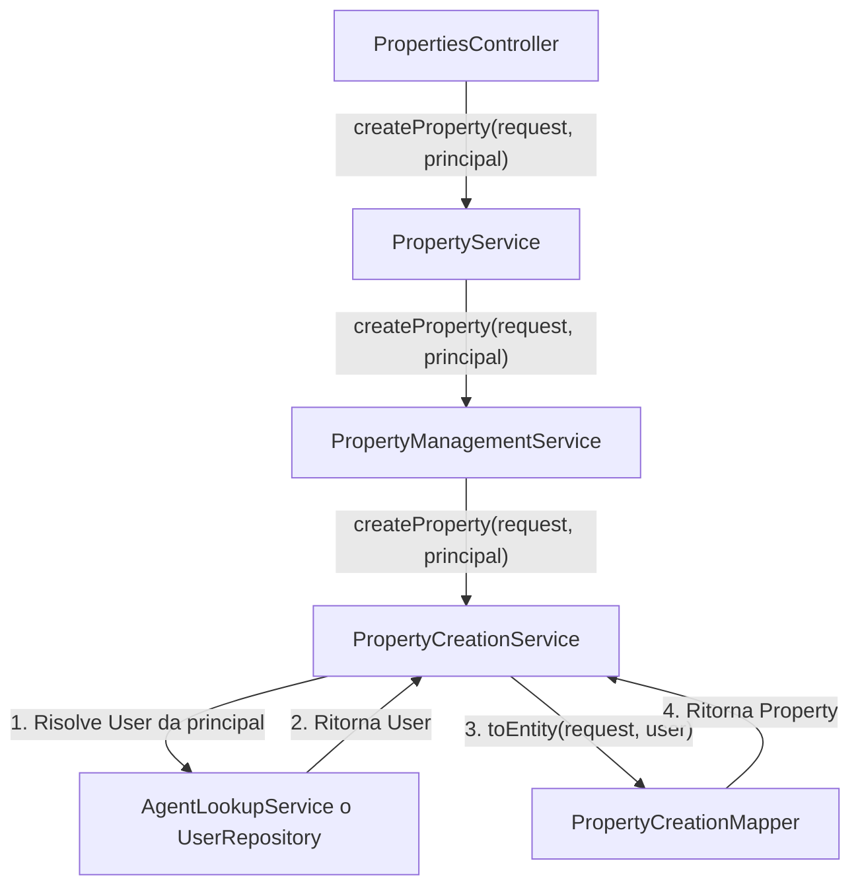

# Piano di Implementazione: Propagazione di AppPrincipal

**Obiettivo:** Modificare la catena di creazione delle proprietà per passare in modo sicuro e pulito l'identità dell'utente autenticato (`AppPrincipal`) dal `PropertiesController` fino al `PropertyCreationMapper`.

**Strategia:** Utilizzeremo la propagazione esplicita dei parametri, modificando le firme dei metodi `createProperty` nei servizi coinvolti per accettare l'oggetto `AppPrincipal`.

**Flusso dei Dati:**

**Piano Operativo (Task List):**

1.  **Modificare `PropertyService`**:
    *   Aggiornare la firma del metodo `createProperty` per includere `AppPrincipal principal`.
    *   Passare il `principal` alla chiamata a `propertyManagementService.createProperty`.

2.  **Modificare `PropertyManagementService`**:
    *   Aggiornare la firma del metodo `createProperty` per includere `AppPrincipal principal`.
    *   Passare il `principal` alla chiamata a `propertyCreationService.createProperty`.

3.  **Modificare `PropertyCreationService`**:
    *   Aggiornare la firma del metodo `createProperty` per includere `AppPrincipal principal`.
    *   Utilizzare l'ID dall'`AppPrincipal` per recuperare l'entità `User` (l'agente) tramite un servizio di lookup.
    *   Passare l'entità `User` recuperata al `PropertyCreationMapper`.
    *   Rimuovere la logica che risolveva l'agente basandosi sul `request.getAgentUsername()`.

4.  **Verificare `AgentLookupService`**:
    *   Assicurarsi che esista un metodo per risolvere un `User` a partire da un `AppPrincipal` o dal suo ID. Se non esiste, implementarlo.