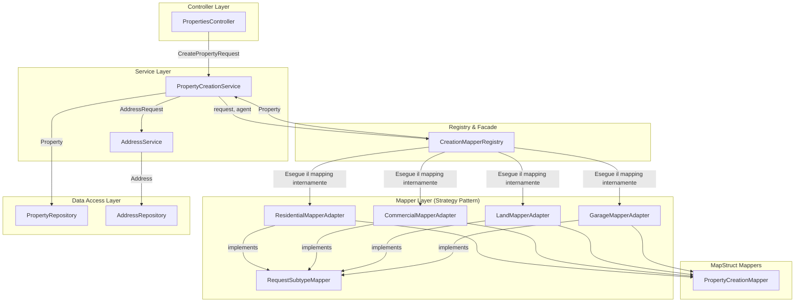

# Piano di Refactoring Architetturale (Revisione 3)

## 1. Introduzione

Questo documento delinea una strategia di refactoring per il `PropertyCreationService` con l'obiettivo di eliminare le violazioni dei principi SOLID e Clean Code. A seguito di un importante feedback, questa revisione si concentra sull'eliminazione **totale** di cast espliciti dal codice client, incapsulando la logica di type-safety all'interno di un componente dedicato.

La soluzione si basa su un'architettura polimorfica che utilizza i pattern **Strategy**, **Adapter** e un **Registry** che agisce anche da **Facade** per il mapping.

## 2. Diagramma della Soluzione Proposta



## 3. Componenti dell'Architettura

### 3.1. Interfaccia `RequestSubtypeMapper` (Strategy)

Questa interfaccia rimane invariata. Stabilisce il contratto per tutti i mapper di sottotipi.

```java
// in com.dieti.dietiestatesbackend.mappers
public interface RequestSubtypeMapper<T extends AbstractCreatePropertyRequest> {
    Class<T> getRequestType();
    Property toEntity(T request, User agent);
}
```

### 3.2. Classi Adapter per Mapper MapStruct

Anche gli adapter rimangono invariati. Fungono da ponte tra la nostra interfaccia e i mapper MapStruct.

```java
// in com.dieti.dietiestatesbackend.mappers.adapters
@Component
public class ResidentialPropertyMapperAdapter implements RequestSubtypeMapper<CreateResidentialPropertyRequest> {
    // ... implementazione come prima ...
}
```

### 3.3. `CreationMapperRegistry` (Registry + Facade) - **REVISIONATO**

Questo componente è stato potenziato. Oltre a registrare i mapper, ora espone un metodo `map` che astrae completamente la selezione e l'invocazione del mapper corretto. Il cast, sebbene logicamente sicuro grazie alla struttura della mappa, è ora un **dettaglio di implementazione privato** e invisibile al resto dell'applicazione.

```java
// in com.dieti.dietiestatesbackend.mappers
@Component
public class CreationMapperRegistry {

    private final Map<Class<? extends AbstractCreatePropertyRequest>, RequestSubtypeMapper<?>> mapperMap;

    @Autowired
    public CreationMapperRegistry(List<RequestSubtypeMapper<?>> mappers) {
        this.mapperMap = mappers.stream()
                .collect(Collectors.toMap(RequestSubtypeMapper::getRequestType, Function.identity()));
    }

    /**
     * Esegue il mapping di una richiesta alla sua entità Property corrispondente,
     * selezionando dinamicamente il mapper corretto.
     * Questo metodo funge da Facade, nascondendo la complessità dei tipi generici.
     *
     * @param request Il DTO della richiesta di creazione.
     * @param agent L'utente agente che crea la proprietà.
     * @return L'entità Property mappata.
     * @throws IllegalArgumentException se non viene trovato alcun mapper per il tipo di richiesta.
     */
    public <T extends AbstractCreatePropertyRequest> Property map(T request, User agent) {
        // Il cast è ora un dettaglio di implementazione privato di questo metodo.
        RequestSubtypeMapper<T> mapper = findMapperFor(request);
        return mapper.toEntity(request, agent);
    }

    @SuppressWarnings("unchecked")
    private <T extends AbstractCreatePropertyRequest> RequestSubtypeMapper<T> findMapperFor(T request) {
        RequestSubtypeMapper<?> mapper = mapperMap.get(request.getClass());
        if (mapper == null) {
            throw new IllegalArgumentException("Nessun mapper trovato per il tipo di richiesta: " + request.getClass().getName());
        }
        // Questo cast è sicuro perché la mappa è costruita garantendo che la chiave
        // Class<T> corrisponda sempre al tipo generico del valore RequestSubtypeMapper<T>.
        return (RequestSubtypeMapper<T>) mapper;
    }
}
```

### 3.4. `PropertyCreationService` Semplificato - **REVISIONATO**

Il servizio è ora ancora più pulito e aderente al Law of Demeter. Non conosce più l'interfaccia `RequestSubtypeMapper`, ma solo il `CreationMapperRegistry`, che utilizza come una "scatola nera" per ottenere l'entità mappata.

```java
// in com.dieti.dietiestatesbackend.service
@Service
public class PropertyCreationService {

    private final CreationMapperRegistry mapperRegistry;
    private final AgentLookupService agentLookupService;
    private final PropertyRepository propertyRepository;
    private final AddressService addressService;

    // ... costruttore ...

    @Transactional
    public Property createProperty(AbstractCreatePropertyRequest request) {
        // 1. Autenticazione e recupero dell'agente
        User agent = // ... logica esistente ...

        // 2. Gestione centralizzata dell'indirizzo
        Address savedAddress = addressService.createAndGeocodeAddress(request.getAddressRequest());

        // 3. Mapping polimorfico tramite il registro (Facade)
        Property property = mapperRegistry.map(request, agent);
        property.setAddress(savedAddress);

        // 4. Salvataggio
        return propertyRepository.save(property);
    }
}
```

## 4. Piano di Implementazione (Todo List per la modalità Code)

- [ ] **Definire l'interfaccia `RequestSubtypeMapper`:**
      - [ ] Creare il file `RequestSubtypeMapper.java` nel package `com.dieti.dietiestatesbackend.mappers`.
- [ ] **Creare gli Adapter per i mapper esistenti:**
      - [ ] Creare il package `com.dieti.dietiestatesbackend.mappers.adapters`.
      - [ ] Implementare `ResidentialPropertyMapperAdapter.java`.
      - [ ] Implementare `CommercialPropertyMapperAdapter.java`.
      - [ ] Implementare `LandPropertyMapperAdapter.java`.
      - [ ] Implementare `GaragePropertyMapperAdapter.java`.
- [ ] **Implementare il `CreationMapperRegistry` (versione Facade):**
      - [ ] Creare/aggiornare il file `CreationMapperRegistry.java` con il metodo `map` pubblico e il metodo `findMapperFor` privato.
- [ ] **Refactor `PropertyCreationService`:**
      - [ ] Rimuovere il metodo `buildConcreteProperty` e lo `switch`.
      - [ ] Iniettare `CreationMapperRegistry` e `AddressService`.
      - [ ] Aggiornare il metodo `createProperty` per chiamare `mapperRegistry.map(request, agent)`.
- [ ] **Refactor `AddressService`:**
      - [ ] Assicurarsi che esista un metodo come `createAndGeocodeAddress` che accetti un `AddressRequest` e restituisca un'entità `Address` gestita.

## 5. Conclusione

Questa versione del piano affronta direttamente il feedback ricevuto, eliminando ogni traccia di cast dal codice client e incapsulando la gestione dei tipi generici in un unico punto controllato. L'architettura risultante è estremamente pulita, sicura, e aderisce in modo ancora più rigoroso ai principi di Clean Code e Separation of Concerns.