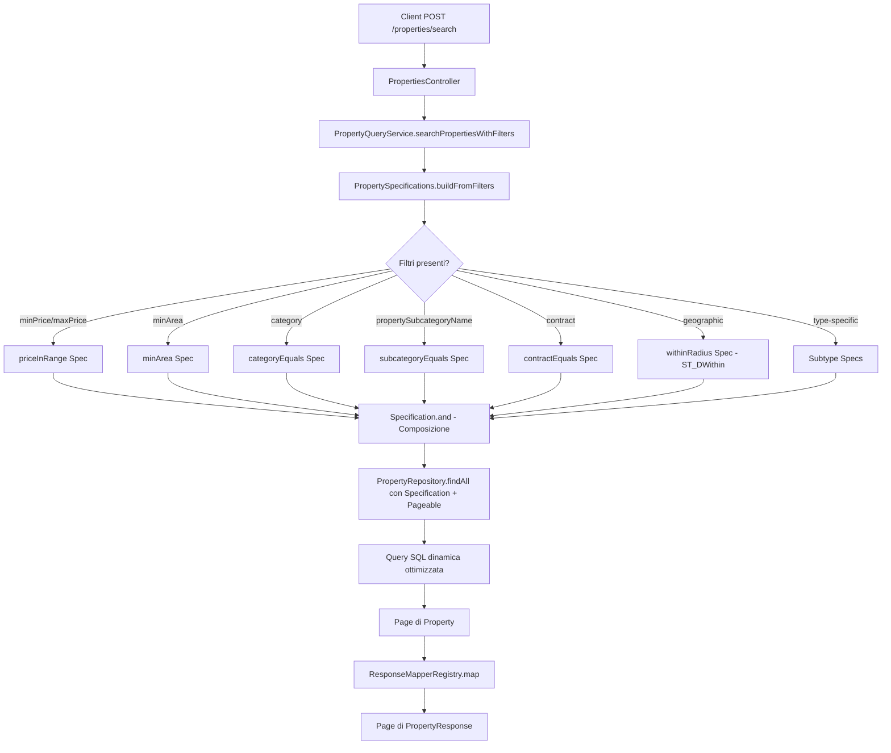
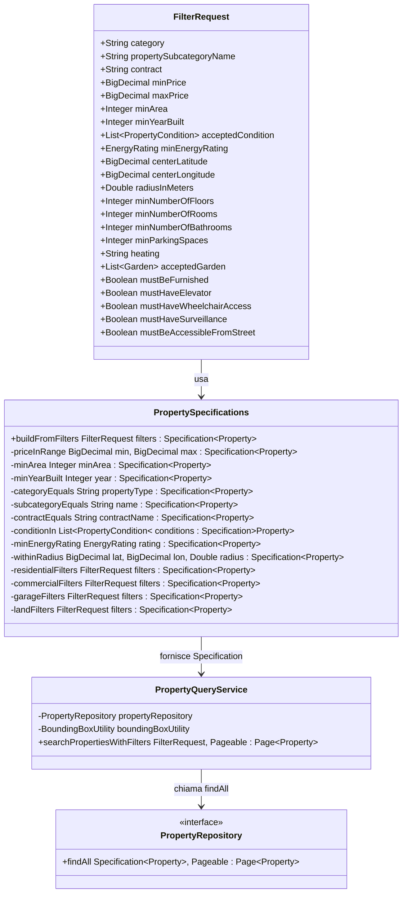

# Piano Architetturale: Correzione Filtri Ricerca Proprietà

## 1. Analisi del Problema Attuale

### 1.1 Problema Identificato

Nel metodo [`PropertyQueryService.searchPropertiesWithFilters()`](../src/main/java/com/dieti/dietiestatesbackend/service/PropertyQueryService.java:44), vengono passati **solo i parametri del bounding box geografico** alla query [`searchWithFiltersAndEagerFetch`](../src/main/java/com/dieti/dietiestatesbackend/repositories/PropertyRepository.java:62):

```java
return propertyRepository.searchWithFiltersAndEagerFetch(
    bounds[0], bounds[1], bounds[2], bounds[3], pageable
);
```

**Tutti i filtri facoltativi** definiti in [`FilterRequest`](../src/main/java/com/dieti/dietiestatesbackend/dto/request/FilterRequest.java) vengono **completamente ignorati**:
- `minPrice`, `maxPrice`
- `minArea`, `minYearBuilt`
- `category`, `contract`
- `acceptedCondition`, `minEnergyRating`
- Filtri specifici per tipo (stanze, bagni, riscaldamento, etc.)

### 1.2 Struttura Attuale Category/Subcategory

L'entità [`PropertyCategory`](../src/main/java/com/dieti/dietiestatesbackend/entities/PropertyCategory.java) ha una struttura a due livelli:

| Campo | Descrizione | Esempi |
|-------|-------------|--------|
| `propertyType` | Macro-categoria/discriminatore | RESIDENTIAL, COMMERCIAL, LAND, GARAGE |
| `name` | Sottocategoria specifica | Apartment, Villa, Office, Shop, Warehouse |

Il campo `category` nel [`FilterRequest`](../src/main/java/com/dieti/dietiestatesbackend/dto/request/FilterRequest.java:29) filtra solo per `propertyType`. **Manca un campo per la sottocategoria**.

## 2. Soluzione Architetturale Proposta

### 2.1 Approccio: JPA Specifications

Utilizzeremo **JPA Criteria API con Specifications** per costruire query dinamiche. Il repository [`PropertyRepository`](../src/main/java/com/dieti/dietiestatesbackend/repositories/PropertyRepository.java:29) già estende `JpaSpecificationExecutor<Property>`.

### 2.2 Diagramma del Flusso di Ricerca



### 2.3 Struttura delle Classi



## 3. Piano di Implementazione Dettagliato

### Fase 1: Modifica del DTO FilterRequest

**File:** [`src/main/java/com/dieti/dietiestatesbackend/dto/request/FilterRequest.java`](../src/main/java/com/dieti/dietiestatesbackend/dto/request/FilterRequest.java)

**Modifiche:**
```java
// Aggiungere dopo il campo category (linea 30)
/**
 * Nome specifico della sottocategoria (es. Apartment, Villa, Office).
 * Se specificato insieme a category, filtra per entrambi.
 * Se specificato da solo, trova la sottocategoria indipendentemente dalla macro-categoria.
 */
private String propertySubcategoryName;
```

### Fase 2: Creazione della Classe PropertySpecifications

**File nuovo:** `src/main/java/com/dieti/dietiestatesbackend/specifications/PropertySpecifications.java`

**Struttura:**
```java
@UtilityClass
public class PropertySpecifications {

    public static Specification<Property> buildFromFilters(FilterRequest filters) {
        return Specification.where(withinRadius(filters))
            .and(priceInRange(filters.getMinPrice(), filters.getMaxPrice()))
            .and(minArea(filters.getMinArea()))
            .and(minYearBuilt(filters.getMinYearBuilt()))
            .and(categoryEquals(filters.getCategory()))
            .and(subcategoryEquals(filters.getPropertySubcategoryName()))
            .and(contractEquals(filters.getContract()))
            .and(conditionIn(filters.getAcceptedCondition()))
            .and(minEnergyRating(filters.getMinEnergyRating()))
            .and(typeSpecificFilters(filters));
    }
    
    // Metodi privati per ogni filtro...
}
```

### Fase 3: Implementazione Filtri Geografici con ST_DWithin

Per sfruttare l'indice GIST sulla colonna `geography`, useremo una native query fragment:

```java
private static Specification<Property> withinRadius(FilterRequest filters) {
    return (root, query, cb) -> {
        if (filters.getCenterLatitude() == null || 
            filters.getCenterLongitude() == null || 
            filters.getRadiusInMeters() == null) {
            return null;
        }
        
        Join<Property, Address> addressJoin = root.join("address");
        
        // Usa funzione nativa ST_DWithin per sfruttare indice GIST
        return cb.isTrue(
            cb.function("ST_DWithin",
                Boolean.class,
                addressJoin.get("geography"),
                cb.function("ST_SetSRID",
                    Object.class,
                    cb.function("ST_MakePoint",
                        Object.class,
                        cb.literal(filters.getCenterLongitude()),
                        cb.literal(filters.getCenterLatitude())
                    ),
                    cb.literal(4326)
                ),
                cb.literal(filters.getRadiusInMeters())
            )
        );
    };
}
```

### Fase 4: Implementazione Filtri per Sottotipi

Per gestire i filtri specifici delle sottoclassi, utilizzeremo `cb.treat()`:

```java
private static Specification<Property> residentialFilters(FilterRequest filters) {
    return (root, query, cb) -> {
        // Verifica se il filtro è rilevante
        if (!hasResidentialFilters(filters)) {
            return null;
        }
        
        // Treat per accedere ai campi della sottoclasse
        Root<ResidentialProperty> residential = cb.treat(root, ResidentialProperty.class);
        
        List<Predicate> predicates = new ArrayList<>();
        
        if (filters.getMinNumberOfRooms() != null) {
            predicates.add(cb.greaterThanOrEqualTo(
                residential.get("numberOfRooms"), 
                filters.getMinNumberOfRooms()
            ));
        }
        
        if (filters.getMustBeFurnished() != null && filters.getMustBeFurnished()) {
            predicates.add(cb.isTrue(residential.get("isFurnished")));
        }
        
        // ... altri filtri residenziali
        
        return predicates.isEmpty() ? null : cb.and(predicates.toArray(new Predicate[0]));
    };
}
```

### Fase 5: Refactoring PropertyQueryService

**File:** [`src/main/java/com/dieti/dietiestatesbackend/service/PropertyQueryService.java`](../src/main/java/com/dieti/dietiestatesbackend/service/PropertyQueryService.java)

**Modifiche al metodo `searchPropertiesWithFilters`:**

```java
public Page<Property> searchPropertiesWithFilters(FilterRequest filters, Pageable pageable) {
    Objects.requireNonNull(filters, "filters must not be null");
    Objects.requireNonNull(pageable, "pageable must not be null");
    
    // Costruisci la Specification dinamicamente
    Specification<Property> spec = PropertySpecifications.buildFromFilters(filters);
    
    // Usa il repository con Specification
    return propertyRepository.findAll(spec, pageable);
}
```

**Nota:** Dovremo gestire l'eager loading delle relazioni. Opzioni:
1. Usare `@EntityGraph` su un nuovo metodo del repository
2. Mantenere un approccio ibrido con fetch join dove necessario

### Fase 6: Migrazione Database per Indici Mancanti

**File nuovo:** `src/main/resources/db/migration/V7__add_filter_indexes.sql`

```sql
-- Indici per tabelle figlie (migliorano performance filtri specifici)
CREATE INDEX IF NOT EXISTS idx_residential_rooms ON residential_property (number_of_rooms);
CREATE INDEX IF NOT EXISTS idx_residential_bathrooms ON residential_property (number_of_bathrooms);
CREATE INDEX IF NOT EXISTS idx_residential_heating ON residential_property (id_heating);
CREATE INDEX IF NOT EXISTS idx_residential_garden ON residential_property (garden);
CREATE INDEX IF NOT EXISTS idx_residential_furnished ON residential_property (is_furnished);
CREATE INDEX IF NOT EXISTS idx_residential_elevator ON residential_property (has_elevator);

CREATE INDEX IF NOT EXISTS idx_commercial_rooms ON commercial_property (number_of_rooms);
CREATE INDEX IF NOT EXISTS idx_commercial_wheelchair ON commercial_property (wheelchair_access);

CREATE INDEX IF NOT EXISTS idx_garage_surveillance ON garage (has_surveillance);

CREATE INDEX IF NOT EXISTS idx_land_street ON land (accessible_from_street);

-- Indice composto per ricerche frequenti
CREATE INDEX IF NOT EXISTS idx_property_category_contract 
    ON property (id_property_category, id_contract);
```

## 4. Gestione Relazione Category/Subcategory

### 4.1 Logica di Filtro

| category | propertySubcategoryName | Comportamento |
|----------|-------------------------|---------------|
| null | null | Nessun filtro su categoria |
| RESIDENTIAL | null | Tutte le proprietà residenziali |
| null | Apartment | Tutte le proprietà con sottocategoria Apartment |
| RESIDENTIAL | Apartment | Solo appartamenti residenziali |

### 4.2 Implementazione

```java
private static Specification<Property> categoryEquals(String propertyType) {
    return (root, query, cb) -> {
        if (propertyType == null || propertyType.isBlank()) {
            return null;
        }
        Join<Property, PropertyCategory> categoryJoin = root.join("propertyCategory");
        return cb.equal(categoryJoin.get("propertyType"), propertyType);
    };
}

private static Specification<Property> subcategoryEquals(String subcategoryName) {
    return (root, query, cb) -> {
        if (subcategoryName == null || subcategoryName.isBlank()) {
            return null;
        }
        Join<Property, PropertyCategory> categoryJoin = root.join("propertyCategory");
        return cb.equal(categoryJoin.get("name"), subcategoryName);
    };
}
```

## 5. Considerazioni su Performance

### 5.1 Indici Esistenti (V1)

| Tabella | Colonna | Indice |
|---------|---------|--------|
| property | price | ✅ idx_properties_price |
| property | area | ✅ idx_properties_area |
| property | year_built | ✅ idx_properties_year_built |
| property | property_category_id | ✅ idx_properties_property_category_id |
| property | contract_id | ✅ idx_properties_contract_id |
| address | geography | ✅ idx_address_geography_gist (V4) |

### 5.2 Indici da Aggiungere (V7)

- Campi filtrati nelle tabelle figlie
- Indice composto category+contract per ricerche frequenti

### 5.3 Ottimizzazione Query

1. **Eager Loading**: Usare `@EntityGraph` per evitare N+1
2. **Fetch Join Condizionale**: Solo le relazioni necessarie per la risposta
3. **Count Query Separata**: Per paginazione efficiente

## 6. Aggiornamento Documentazione API

### 6.1 Nuovo Parametro da Documentare

Aggiungere a [`docs/API_Ricerca_Proprieta.md`](./API_Ricerca_Proprieta.md):

| Nome Parametro | Tipo | Obbligatorio | Valori Accettati | Descrizione |
|----------------|------|--------------|------------------|-------------|
| `propertySubcategoryName` | String | Facoltativo | Es. Apartment, Villa, Office, Shop | Sottocategoria specifica della proprietà |

### 6.2 Esempio Aggiornato

```json
{
  "category": "RESIDENTIAL",
  "propertySubcategoryName": "Apartment",
  "contract": "SALE",
  "minPrice": 100000,
  "maxPrice": 300000,
  "minNumberOfRooms": 3,
  "centerLatitude": 41.902782,
  "centerLongitude": 12.496366,
  "radiusInMeters": 5000
}
```

## 7. Piano di Test

### 7.1 Test Unitari

**File:** `src/test/java/com/dieti/dietiestatesbackend/specifications/PropertySpecificationsTest.java`

- Test per ogni metodo di specification individuale
- Test per composizione di più filtri
- Test per valori null/vuoti

### 7.2 Test di Integrazione

**File:** `src/test/java/com/dieti/dietiestatesbackend/service/PropertyQueryServiceIntegrationTest.java`

- Test endpoint con varie combinazioni di filtri
- Verifica corretta applicazione filtri geografici
- Verifica paginazione
- Verifica performance con dataset significativo

## 8. Stima Impatto

| Componente | Rischio | Note |
|------------|---------|------|
| FilterRequest | Basso | Modifica additiva, retrocompatibile |
| PropertySpecifications | Medio | Nuova classe, richiede testing accurato |
| PropertyQueryService | Medio | Refactoring metodo esistente |
| PropertyRepository | Basso | Usa già JpaSpecificationExecutor |
| Database | Basso | Solo aggiunta indici |
| API | Basso | Nuovo parametro opzionale |

## 9. Riepilogo Azioni

1. ✏️ Modificare [`FilterRequest.java`](../src/main/java/com/dieti/dietiestatesbackend/dto/request/FilterRequest.java) - aggiungere `propertySubcategoryName`
2. 🆕 Creare `PropertySpecifications.java` con tutte le specification
3. ♻️ Refactoring [`PropertyQueryService.java`](../src/main/java/com/dieti/dietiestatesbackend/service/PropertyQueryService.java)
4. 🗄️ Creare migrazione `V7__add_filter_indexes.sql`
5. 📚 Aggiornare [`API_Ricerca_Proprieta.md`](./API_Ricerca_Proprieta.md)
6. 🧪 Scrivere test unitari.