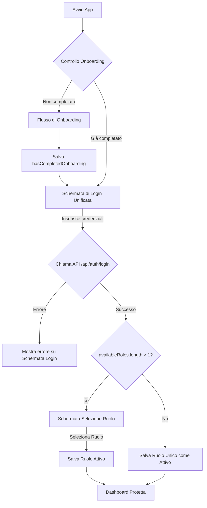

# Piano Architetturale: Nuovo Flusso di Autenticazione B2C

Questo documento descrive il piano architetturale dettagliato per l'implementazione del nuovo flusso di autenticazione B2C, includendo l'onboarding, il login unificato e la selezione del ruolo.

## Diagramma di Flusso

## Fasi di Implementazione

### Fase 1: Preparazione e Refactoring della Struttura di Autenticazione

L'obiettivo di questa fase è rimuovere la logica di autenticazione obsoleta e preparare il terreno per il nuovo flusso unificato.

1.  **Centralizzazione della Schermata di Login:**
    *   **Azione:**
        1.  Spostare `app/(auth)/(buyer)/login.tsx` in `app/(auth)/index.tsx`.
        2.  Eliminare le altre schermate di login: `app/(auth)/(admin)/login.tsx` e `app/(auth)/(agent)/login.tsx`.
    *   **Scopo:** `app/(auth)/index.tsx` diventerà l'unica schermata di login, riutilizzando la struttura esistente.

2.  **Semplificazione della Struttura delle Route di Autenticazione:**
    *   **File da modificare:**
        *   `app/(auth)/_layout.tsx`: Semplificare la configurazione dello Stack per rimuovere i gruppi non più necessari (`(admin)`, `(agent)`, `(buyer)`). Dovrà gestire solo le schermate `index` (login) e `select-role`.

### Fase 2: Implementazione del Flusso di Onboarding

Questa fase si concentra sulla creazione delle quattro schermate di onboarding e sulla logica di persistenza dello stato.

1.  **Creazione delle Schermate e della Logica di Navigazione:**
    *   **File da creare:**
        *   `app/(onboarding)/_layout.tsx`: Layout per il gruppo di route di onboarding.
        *   `app/(onboarding)/index.tsx`: Schermata principale per la paginazione dell'onboarding.
        *   `components/onboarding/OnboardingStep.tsx`: Componente riutilizzabile per una singola schermata di onboarding.
    *   **Considerazioni tecniche:** Aggiungere la dipendenza `react-native-pager-view`.

2.  **Persistenza dello Stato di Completamento:**
    *   **File da modificare:**
        *   `app/(onboarding)/index.tsx`: Utilizzare `AsyncStorage` per salvare il flag `hasCompletedOnboarding: true` al termine del flusso.

### Fase 3: Logica di Reindirizzamento nel Root Layout

Questa fase instrada l'utente verso l'onboarding o il flusso di autenticazione principale all'avvio dell'app.

1.  **Implementazione della Logica di Reindirizzamento Condizionale:**
    *   **File da modificare:**
        *   `app/_layout.tsx`: Nel `RootLayout`, implementare la logica per reindirizzare a `/(onboarding)` o `/(auth)` in base allo stato di autenticazione e al flag `hasCompletedOnboarding`.

### Fase 4: Semplificazione e Unificazione del Login

L'obiettivo è riadattare il componente `LoginForm.tsx` per funzionare come un unico punto di accesso.

1.  **Semplificazione del Componente `LoginForm.tsx`:**
    *   **Azione:** Modificare il file `components/LoginForm.tsx`.
    *   **Scopo:** Trasformarlo da un componente multi-ruolo a un componente di login unificato.
    *   **Modifiche Dettagliate:**
        *   Rimuovere la prop `userType`.
        *   I testi (es. "Admin Access") diventeranno generici (es. "Accedi" o "Benvenuto").
        *   La chiamata `signIn` verrà semplificata per non richiedere più il `userType` (es. `signIn({ email, password })`).
        *   I pulsanti di social login (GitHub, Google, MTA) saranno sempre visibili, rimuovendo la condizione `userType === 'buyer'`.

2.  **Aggiornamento del Contesto di Autenticazione (`AuthContext`):**
    *   **Azione:** Modificare il file `context/AuthContext.tsx`.
    *   **Scopo:** Aggiornare la funzione `signIn` per allinearla al nuovo backend. Non accetterà più `userType` come parametro e gestirà la risposta contenente `accessToken`, `refreshToken` e `availableRoles`.

### Fase 5: Riadattamento della Selezione Ruolo Post-Login

L'obiettivo è riutilizzare l'attuale schermata `app/(auth)/index.tsx` (che contiene la UI per la selezione del ruolo) per farla funzionare *dopo* il login.

1.  **Rinominare il File per Chiarezza:**
    *   **Azione:** Rinominare il file `app/(auth)/index.tsx` in `app/(auth)/select-role.tsx`.
    *   **Scopo:** Il nome del file rifletterà il suo nuovo scopo: una schermata per selezionare il ruolo dopo l'autenticazione.

2.  **Riadattare la Logica (Mantenendo la UI):**
    *   **Azione:** Modificare il codice all'interno del nuovo file `app/(auth)/select-role.tsx`.
    *   **Scopo:** L'interfaccia utente esistente (con le `RoleCard`) sarà riciclata. La logica, invece, verrà riscritta come segue:
        *   **Dati Dinamici:** La lista `roleData` non sarà più statica. I dati per le card verranno generati dinamicamente a partire da `availableRoles`, recuperati dal `AuthContext` dopo un login andato a buon fine.
        *   **Nuova Azione `onSelect`:** Quando un utente clicca su una `RoleCard`, la funzione `onSelect` non reindirizzerà più a una pagina di login. Invece, invocherà una nuova funzione del `AuthContext` (es. `setActiveRole(role)`) per salvare il ruolo scelto.
        *   **Reindirizzamento Finale:** Dopo aver salvato il ruolo, l'utente verrà reindirizzato alla dashboard corretta.