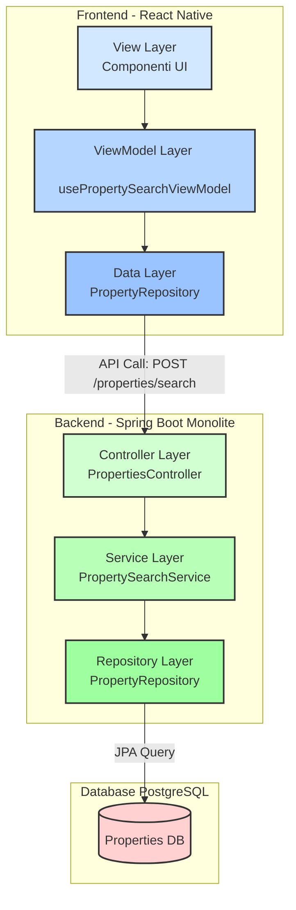

# Progettazione Architetturale: Sottosistema di Ricerca Immobili

## 1. Introduzione e Obiettivi

Questo documento definisce la nuova architettura per la funzionalità di ricerca immobili, coprendo sia il backend che il frontend. L'obiettivo è creare un sistema scalabile, manutenibile e testabile, aderendo rigorosamente ai principi di Clean Code, Clean Architecture e ai pattern di progettazione appropriati.

L'architettura si basa sul contratto API definito in `POST /properties/search`.

## 2. Principi Guida Applicati

- **Clean Architecture:** Netta separazione tra i layer (Presentation, Application, Domain, Infrastructure) per disaccoppiare la logica di business dai dettagli implementativi.
- **SOLID:**
    - **SRP (Single Responsibility Principle):** Ogni classe/modulo ha una sola responsabilità.
    - **OCP (Open/Closed Principle):** Il sistema è estensibile (es. nuovi filtri) senza modificare il codice esistente, grazie a pattern come lo Specification Pattern.
    - **DIP (Dependency Inversion Principle):** I layer superiori dipendono da astrazioni, non da implementazioni concrete dei layer inferiori.
- **Separation of Concerns (SoC):** La logica UI è separata dalla logica di business e dall'accesso ai dati.
- **DRY (Don't Repeat Yourself):** La logica è centralizzata e non duplicata.
- **KISS (Keep It Simple, Stupid) & YAGNI (You Ain't Gonna Need It):** Il design è mantenuto il più semplice possibile, focalizzandosi sui requisiti attuali ma rimanendo flessibile per il futuro.

## 3. Architettura Backend (Integrazione con Architettura Esistente)

L'architettura del backend DietiEstates25 è un **monolite Spring Boot** che segue un pattern di **Layered Architecture**. La nuova funzionalità di ricerca si integrerà perfettamente con questa struttura esistente.

### Layer Esistenti (da Integrare):
1.  **Presentation Layer (Controller):** Gestisce le richieste HTTP e le risposte JSON. La ricerca utilizzerà l'endpoint esistente `POST /properties/search` tramite `PropertiesController`.
2.  **Service Layer:** Contiene la logica di business principale. La nuova funzionalità sarà implementata in `PropertySearchService`.
3.  **Data Access Layer (Repository):** Responsabile della persistenza dei dati tramite Spring Data JPA. La ricerca utilizzerà `PropertyRepository`.
4.  **Domain Layer (Entities):** Definisce la struttura dei dati dell'applicazione (`Property`, `Address`, etc.).

### Miglioramenti Proposti per la Ricerca:
- **Specification Pattern:** Implementato nel Service Layer per costruire query dinamiche e componibili basate sui filtri di ricerca, mantenendo il principio **Open/Closed (OCP)**.
- **DTO Pattern:** Utilizzo consistente di Data Transfer Objects (`PropertySearchRequest`, `PropertySummaryResponse`) per il trasferimento dati tra layer.
- **MapStruct Integration:** Per il mapping efficiente tra Entità e DTO, già presente nell'architettura esistente.

### Tecnologie Chiave (Esistenti):
- **Spring Boot 3.5.4**
- **Spring Data JPA** con **PostgreSQL**
- **MapStruct** per il mapping DTO-Entità
- **Spring WebFlux** per integrazioni con servizi esterni (es. Geoapify)
- **Lombok** per ridurre il boilerplate code

### Flusso di Integrazione:
Il flusso rimane coerente con l'architettura esistente: Client → Controller → Service → Repository → Database, con utilizzo di DTO e mapping tramite MapStruct.

## 4. Architettura Frontend

L'architettura del frontend si basa sul pattern **MVVM (Model-View-ViewModel)**.

### Layer:
1.  **View Layer (UI):** Componenti React "stupidi" (`SearchScreen`, `FilterPanel`) che renderizzano lo stato e catturano l'input dell'utente.
2.  **ViewModel Layer:** Un custom hook `usePropertySearchViewModel` che gestisce lo stato della UI (`properties`, `isLoading`, `error`), espone le azioni (`applySearch`, `updateFilter`) e contiene la logica di presentazione (es. debounce).
3.  **Domain Layer:** Definisce i modelli di business (`Property`) e i contratti per l'accesso ai dati (`IPropertyRepository`).
4.  **Data Layer:** Implementa la comunicazione con l'API tramite `PropertyRepository`, che utilizza un `httpClient` centralizzato e mappa i DTO API in modelli di dominio.

## 5. Diagrammi Architetturali

### Diagramma dei Componenti (Aggiornato per Layered Architecture)


### Diagramma di Flusso della Ricerca (Aggiornato)
```mermaid
sequenceDiagram
    actor User
    participant FE_View as Frontend UI
    participant FE_ViewModel as ViewModel
    participant FE_Data as FE Data Layer
    participant Controller as Backend Controller
    participant Service as Backend Service
    participant Repository as Backend Repository
    participant Database as PostgreSQL DB

    User->>FE_View: 1. Applica filtri e avvia la ricerca
    FE_View->>FE_ViewModel: 2. invoca handleSearch()
    FE_ViewModel->>FE_View: 3. Aggiorna stato UI [isLoading=true]
    FE_ViewModel->>FE_Data: 4. repository.search(filters)
    FE_Data->>Controller: 5. POST /properties/search
    Controller->>Service: 6. service.search(criteria)
    Note over Service,Repository: Costruisce la query<br/>usando lo Specification Pattern
    Service->>Repository: 7. repository.findAll(specs)
    Repository->>Database: 8. Esegue query SQL/JPA
    Database-->>Repository: 9. Restituisce i record
    Repository-->>Service: 10. Restituisce le entità
    Service->>Controller: 11. Mappa entità in DTO (MapStruct)
    Controller->>FE_Data: 12. Risposta HTTP 200 [JSON]
    FE_Data->>FE_ViewModel: 13. Mappa DTO in modelli di dominio
    FE_ViewModel->>FE_View: 14. Aggiorna stato UI [properties, isLoading=false]
    FE_View->>User: 15. Mostra la lista dei risultati