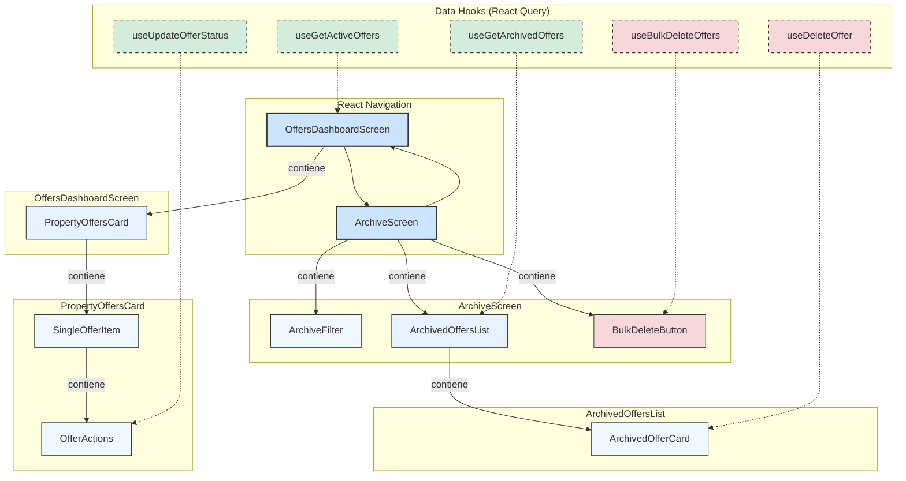

# Architettura Interfaccia Gestione Offerte

Questo documento definisce l'architettura dei componenti React Native per l'interfaccia di gestione delle offerte dell'agente immobiliare.

## 1. Struttura dei Dati (Interfacce TypeScript)

Le seguenti interfacce definiscono i modelli di dati per le offerte e le proprietà.

```typescript
/**
 * Rappresenta lo stato di un'offerta.
 */
export enum OfferStatus {
  Active = 'active',
  Accepted = 'accepted',
  Rejected = 'rejected',
  Archived = 'archived', // Stato per offerte cancellate dalla vista dell'agente
}

/**
 * Rappresenta l'acquirente che ha effettuato l'offerta.
 */
export interface Buyer {
  id: string;
  name: string;
  // Altre informazioni pertinenti sull'acquirente (es. email, telefono)
  // verranno aggiunte qui se necessario.
}

/**
 * Rappresenta una singola offerta per un immobile.
 */
export interface Offer {
  id: string;
  amount: number;
  status: OfferStatus;
  buyer: Buyer;
  createdAt: string; // ISO 8601 date string
}

/**
 * Rappresenta un immobile con le relative offerte.
 * Questo è il modello di dati principale per la schermata "Offerte".
 */
export interface PropertyWithOffers {
  id: string;
  address: string;
  imageUrl: string;
  offers: Offer[];
}

---

## 2. Gerarchia dei Componenti

La struttura dei componenti è pensata per essere modulare e riutilizzabile.

### Screen Components

Componenti di primo livello che rappresentano le schermate principali dell'interfaccia.

- **`OffersDashboardScreen`**:
    - **Scopo**: Schermata principale per la gestione delle offerte attive. Mostra una lista di `PropertyOffersCard`.
    - **Props**: Nessuna.
    - **Stato**: Gestisce la lista di immobili con offerte attive.

- **`ArchiveScreen`**:
    - **Scopo**: Mostra le offerte archiviate (accettate e rifiutate). Contiene `ArchiveFilter` e `ArchivedOffersList`.
    - **Props**: Nessuna.
    - **Stato**: Gestisce il filtro attivo (`accepted` o `rejected`) e la lista di offerte archiviate.

### Container Components

Componenti che contengono e gestiscono la logica per altri componenti UI.

- **`PropertyOffersCard`**:
    - **Scopo**: Card "a fisarmonica" per un singolo immobile nella `OffersDashboardScreen`.
    - **Props**: `property: PropertyWithOffers`.
    - **Stato**: Gestisce lo stato di espansione (aperto/chiuso) per mostrare/nascondere le `SingleOfferItem`.

- **`ArchivedOffersList`**:
    - **Scopo**: Renderizza una lista di `ArchivedOfferCard` in base al filtro selezionato.
    - **Props**: `offers: Offer[]`, `status: OfferStatus`.

### UI Components

Componenti riutilizzabili focalizzati sulla presentazione.

- **`SingleOfferItem`**:
    - **Scopo**: Mostra i dettagli di una singola offerta all'interno della `PropertyOffersCard`.
    - **Props**: `offer: Offer`.

- **`ArchivedOfferCard`**:
    - **Scopo**: Card che visualizza un'offerta accettata o rifiutata. Mostra un pulsante "Contatta" per le offerte accettate e un pulsante "Cancella" per tutte.
    - **Props**: `offer: Offer`, `property: { address: string, imageUrl: string }`, `onDelete: (offerId) => void`, `onContact: (buyerId) => void`.

- **`OfferActions`**:
    - **Scopo**: Contiene i pulsanti "Accept" e "Reject" per una singola offerta.
    - **Props**: `offer: Offer`, `onAccept: (offerId) => void`, `onReject: (offerId) => void`.

- **`ArchiveFilter`**:
    - **Scopo**: Pulsanti di filtro per "Tutte", "Accettate" e "Rifiutate" nell'`ArchiveScreen`.
    - **Props**: `activeFilter: OfferStatus | 'all'`, `onChangeFilter: (status) => void`.

- **`BulkDeleteButton`**:
	- **Scopo**: Pulsante per cancellare tutte le offerte visualizzate nel filtro corrente.
	- **Props**: `onBulkDelete: () => void`.

---

## 3. Gestione dello Stato

La gestione dello stato sarà suddivisa in due categorie: Stato del Server e Stato Locale dell'UI.

### Stato del Server (Dati Remoti)

Per la gestione dei dati asincroni provenienti dal backend (offerte, immobili), si raccomanda l'utilizzo di **React Query (TanStack Query)**.

- **`useGetActiveOffers`**: Un custom hook che utilizza `useQuery` per recuperare la lista di immobili con offerte attive. Gestirà il caching, il refetching in background e gli stati di caricamento/errore.
- **`useGetArchivedOffers`**: Un custom hook che utilizza `useQuery` per recuperare le offerte archiviate, accettando lo `status` ('all', 'accepted', 'rejected') come parametro.
- **`useUpdateOfferStatus`**: Un custom hook che utilizza `useMutation` per gestire l'aggiornamento dello stato di un'offerta (accettazione/rifiuto). Questo hook gestirà l'aggiornamento ottimistico dell'UI e invaliderà le query pertinenti (`useGetActiveOffers`, `useGetArchivedOffers`) per garantire che i dati visualizzati siano sempre coerenti.
- **`useDeleteOffer`**: Un nuovo custom hook che utilizza `useMutation` per "cancellare" un'offerta (impostando il suo stato su `Archived`). Invaliderà la query `useGetArchivedOffers` per rimuovere l'elemento dall'UI.
- **`useBulkDeleteOffers`**: Un nuovo custom hook che utilizza `useMutation` per cancellare in blocco tutte le offerte che corrispondono al filtro corrente.

### Stato Locale dell'UI

Lo stato che è specifico di un componente e non deve essere condiviso globalmente sarà gestito con il hook `useState` di React.

- **Esempio 1**: Lo stato di espansione (aperto/chiuso) della `PropertyOffersCard`.
- **Esempio 2**: Il filtro selezionato (`all`, `accepted` o `rejected`) nella `ArchiveScreen`.

---

## 4. Navigazione

La navigazione tra le schermate sarà gestita utilizzando **React Navigation**. Si propone un `StackNavigator` per gestire il flusso tra la dashboard delle offerte e l'archivio.

### Stack di Navigazione

- **`OffersStack`**:
    - **`OffersDashboard`** (schermata iniziale)
        - **Componente**: `OffersDashboardScreen`
        - **Opzioni**: Titolo "Offerte", un pulsante nell'header per navigare a `Archive`.
    - **`Archive`**
        - **Componente**: `ArchiveScreen`
        - **Opzioni**: Titolo "Archivio Offerte", pulsante di ritorno automatico alla schermata precedente.

### Flusso Utente

1.  L'agente apre l'app e atterra sulla schermata **`OffersDashboard`**.
2.  Dalla dashboard, può cliccare su un pulsante "Archivio" per navigare alla schermata **`Archive`**.
3.  Dalla schermata `Archive`, può tornare alla dashboard utilizzando il pulsante "Indietro" fornito dallo stack navigator.

---

## 5. Diagramma dell'Architettura

Il seguente diagramma illustra la relazione tra i componenti definiti.

