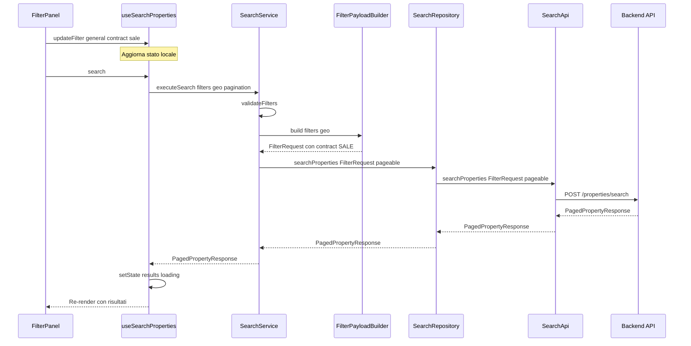

# Piano di Re-implementazione: Funzionalità di Ricerca

## Panoramica

Questo documento descrive il piano architetturale per la re-implementazione completa della funzionalità di ricerca nel client TypeScript/React Native.

## Architettura a Strati

```
┌─────────────────────────────────────────────────────────────────┐
│  UI Layer                                                        │
│  FilterPanel.tsx, SegmentedControl.tsx, RangeSlider.tsx, etc.   │
│  - Componenti presentazionali (dumb)                            │
│  - Nessuna logica di business                                   │
└─────────────────────────────────────────────────────────────────┘
                              │
                              ▼
┌─────────────────────────────────────────────────────────────────┐
│  Hook Layer: useSearchProperties.ts                              │
│  - Gestisce stato: filtri, paginazione, loading, errori         │
│  - Previene ricerche premature                                   │
│  - Orchestra chiamate al Service                                 │
└─────────────────────────────────────────────────────────────────┘
                              │
                              ▼
┌─────────────────────────────────────────────────────────────────┐
│  Service Layer: SearchService.ts                                 │
│  ├── FilterPayloadBuilder.ts (helper interno)                   │
│  - Logica di business e validazione                              │
│  - Costruzione payload FilterRequest                             │
└─────────────────────────────────────────────────────────────────┘
                              │
                              ▼
┌─────────────────────────────────────────────────────────────────┐
│  Repository Layer: SearchRepository.ts                           │
│  - Wrapper semplice verso API Layer                              │
│  - Nessuna logica di trasformazione                              │
└─────────────────────────────────────────────────────────────────┘
                              │
                              ▼
┌─────────────────────────────────────────────────────────────────┐
│  API Layer: SearchApi.ts                                         │
│  - POST /properties/search                                       │
│  - Gestione errori rete e parsing risposta                       │
└─────────────────────────────────────────────────────────────────┘
```

---

## Responsabilità di Ogni Layer

### 1. UI Layer
- **File**: `FilterPanel.tsx`, `SegmentedControl.tsx`, `RangeSlider.tsx`, `PriceInput.tsx`, `QuickNumericSelector.tsx`
- **Responsabilità**: Solo presentazione e raccolta input
- **Interazione**: Chiama l'hook `useSearchProperties` per ottenere stato e invocare azioni

### 2. Hook Layer: useSearchProperties.ts
- **Responsabilità**:
  - Gestione stato locale con `useState`/`useReducer` semplificato
  - Esposizione API chiara per l'UI
  - Prevenzione ricerche premature (solo su `search()` esplicito)
  - Gestione paginazione
  
- **Interfaccia esposta**:
```typescript
interface UseSearchPropertiesReturn {
  // Stato
  filters: SearchFiltersState;
  results: PropertyResponse[];
  isLoading: boolean;
  error: string | null;
  pagination: { page: number; totalPages: number; totalElements: number };
  activeFiltersCount: number;
  
  // Azioni
  updateFilter: (category: FilterCategory, key: string, value: unknown) => void;
  setGeolocation: (geo: Geolocation | null) => void;
  search: () => Promise<void>;
  resetFilters: (options?: { keepContract?: boolean }) => void;
  goToPage: (page: number) => Promise<void>;
}
```

### 3. Service Layer: SearchService.ts
- **Responsabilità**:
  - Validazione filtri (campi geografici obbligatori)
  - Costruzione `FilterRequest` tramite `FilterPayloadBuilder`
  - Applicazione valori di default

- **Interfaccia**:
```typescript
interface ISearchService {
  executeSearch(
    filters: SearchFiltersState,
    geolocation: Geolocation | null,
    pagination: { page?: number; size?: number; sort?: string[] }
  ): Promise<PagedPropertyResponse>;
  
  validateFilters(filters: SearchFiltersState): ValidationResult;
  getDefaultFilters(): SearchFiltersState;
}
```

### 4. FilterPayloadBuilder (Helper del Service)
- **Responsabilità**:
  - Trasformazione da `SearchFiltersState` a `FilterRequest`
  - Mappatura enum: `sale` → `SALE`, `rent` → `RENT`
  - Mappatura categoria → `PropertyCategory`
  - Include solo campi modificati

- **Fix Bug Sale/Rent**:
```typescript
private static mapContract(value: 'sale' | 'rent' | null): 'SALE' | 'RENT' | undefined {
  if (value === 'sale') return 'SALE';
  if (value === 'rent') return 'RENT';
  return undefined;
}
```

### 5. Repository Layer: SearchRepository.ts
- **Responsabilità**: Semplice wrapper verso `SearchApi`
- **Interfaccia**:
```typescript
interface ISearchRepository {
  searchProperties(
    filter: FilterRequest,
    pageable?: { page?: number; size?: number; sort?: string[] }
  ): Promise<PagedPropertyResponse>;
}
```

### 6. API Layer: SearchApi.ts
- **Responsabilità**:
  - Chiamate HTTP tramite `httpClient`
  - Gestione errori di rete
  - Logging del payload per debug

---

## DTO Definitions

### FilterRequest (allineato al backend)
```typescript
interface FilterRequest {
  // OBBLIGATORI
  centerLatitude: number;
  centerLongitude: number;
  radiusInMeters: number;
  
  // Facoltativi
  category?: 'RESIDENTIAL' | 'COMMERCIAL' | 'GARAGE' | 'LAND';
  contract?: 'RENT' | 'SALE';
  minPrice?: number;
  maxPrice?: number;
  minArea?: number;
  minYearBuilt?: number;
  acceptedCondition?: PropertyCondition[];
  minEnergyRating?: EnergyRating;
  minNumberOfFloors?: number;
  minNumberOfRooms?: number;
  minNumberOfBathrooms?: number;
  minParkingSpaces?: number;
  heating?: 'Centralized' | 'Autonomous' | 'Absent';
  acceptedGarden?: Garden[];
  mustBeFurnished?: boolean;
  mustHaveElevator?: boolean;
  mustHaveWheelchairAccess?: boolean;
  mustHaveSurveillance?: boolean;
  mustBeAccessibleFromStreet?: boolean;
}
```

### PropertyResponse
```typescript
interface PropertyResponse {
  id: number;
  description: string;
  price: number;
  area: number;
  yearBuilt: number;
  contract: string;
  propertyCategory: string;
  condition: string;
  energyRating: string;
  address: AddressResponseDTO;
  agent: AgentResponseDTO;
  createdAt: string;
  updatedAt: string;
  firstImageUrl: string;
  numberOfImages: number;
}
```

### PagedPropertyResponse
```typescript
interface PagedPropertyResponse {
  content: PropertyResponse[];
  totalElements: number;
  totalPages: number;
  page: number;
  size: number;
}
```

---

## Gestione AsyncStorage

- **Cosa salvare**: Filtri modificati e geolocalizzazione
- **Quando salvare**: Debounce 500ms dopo ogni modifica
- **Quando caricare**: Al mount dell'hook (hydration)

Repository: `SearchStateRepository.ts` (già esistente)

---

## Diagramma di Flusso della Ricerca



---

## Piano di Implementazione

### Fase 1: DTO e Tipi Base
1. Creare `PropertyResponse.dto.ts`
2. Creare `PagedPropertyResponse.dto.ts`
3. Creare `SearchFiltersState.ts` (stato semplificato)
4. Verificare `FilterRequest.dto.ts`

### Fase 2: FilterPayloadBuilder
1. Riscrivere con mappature complete
2. Fix bug Sale/Rent
3. Implementare mapCategory
4. Test unitari

### Fase 3: API Layer
1. Rivedere gestione errori
2. Verificare paginazione nel body
3. Test

### Fase 4: Repository Layer
1. Semplificare
2. Test

### Fase 5: Service Layer
1. Validazione campi geografici
2. Integrare FilterPayloadBuilder
3. Test

### Fase 6: Hook Layer
1. Stato locale semplificato
2. Prevenzione ricerche premature
3. Paginazione
4. Test

### Fase 7: AsyncStorage
1. Hydration al mount
2. Test persistenza

### Fase 8: UI Layer
1. Semplificare FilterPanel
2. Rimuovere accesso diretto a Context
3. Test e2e

### Fase 9: Cleanup
1. Rimuovere logica legacy da SearchContext
2. Aggiornare imports
3. Documentazione

---

## File da Creare/Modificare

| File | Azione |
|------|--------|
| `src/dto/response/PropertyResponse.dto.ts` | Creare |
| `src/dto/response/PagedPropertyResponse.dto.ts` | Creare |
| `src/dto/SearchFiltersState.ts` | Creare |
| `src/services/FilterPayloadBuilder.ts` | Riscrivere |
| `src/services/SearchService.ts` | Riscrivere |
| `src/repositories/SearchRepository.ts` | Semplificare |
| `src/api/SearchApi.ts` | Rivedere |
| `src/hooks/useSearchProperties.ts` | Riscrivere |
| `components/Buyer/SearchIntegration/FilterPanel.tsx` | Semplificare |
| `context/SearchContext.tsx` | Semplificare (rimuovere logica excess) |