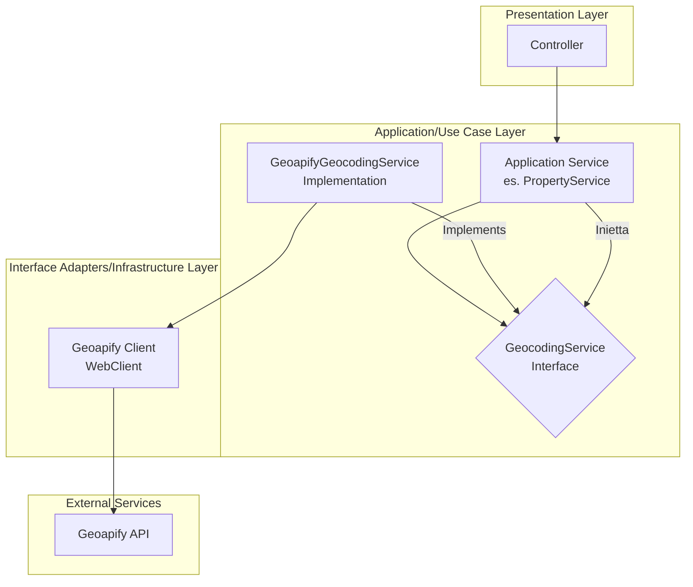

# Piano Architetturale: Integrazione Servizio di Geocoding (Fase 1)

Questo documento delinea l'architettura per integrare un sistema di geocoding robusto, scalabile e ad alte prestazioni basato su Geoapify, garantendo al contempo che l'architettura sia predisposta per una futura e fluida integrazione di un meccanismo di fallback.

## 1. Obiettivo

Sviluppare un servizio di geocodifica primario robusto (Geoapify) e predisporre l'architettura per una futura integrazione di un meccanismo di fallback (es. Google Maps) senza richiedere rifattorizzazioni significative.

## 2. Diagramma Architetturale

Il diagramma illustra l'architettura della Fase 1, focalizzata sul provider primario, mantenendo i punti di estensione per il futuro.



**Estensibilità**: Il disaccoppiamento tramite l'interfaccia `GeocodingService` è la chiave per future estensioni. L'aggiunta di un provider di fallback non richiederà modifiche ai servizi applicativi esistenti.

## 3. Design Patterns

-   **Strategy Pattern**: L'interfaccia `GeocodingService` definisce un contratto comune per qualsiasi servizio di geocoding. `GeoapifyGeocodingService` è la prima implementazione concreta di questa strategia.
-   **Factory Pattern (via Spring `@Bean`)**: La configurazione e la creazione di oggetti complessi come il `WebClient` sono centralizzate in una classe di configurazione dedicata, disaccoppiando la costruzione dall'utilizzo.

## 4. Struttura del Codice

La struttura dei pacchetti è progettata per massimizzare la coesione e rispettare la separazione delle responsabilità (SoC).

```
com.dieti.dietiestatesbackend
└── service
    └── geocoding
        ├── dto                 // DTO per la risposta JSON di Geoapify
        │   └── GeoapifyResponse.java
        ├── provider            // Implementazione concreta della strategia
        │   └── GeoapifyGeocodingService.java
        └── GeocodingService.java          // L'interfaccia (contratto)
com.dieti.dietiestatesbackend
└── config
    ├── GeocodingProperties.java       // Classe @ConfigurationProperties per la type-safety
    └── GeocodingConfig.java           // Configurazione dei @Bean
```

## 5. Configurazione

Le configurazioni saranno esternalizzate e gestite in modo type-safe.

-   **`application.properties`**:
    ```properties
    # Geoapify Configuration
    geocoding.provider.geoapify.api-url=https://api.geoapify.com/v1/geocode/search
    geocoding.provider.geoapify.api-key=LA_TUA_CHIAVE_API
    ```
-   **`@ConfigurationProperties`**: Una classe `GeocodingProperties` mapperà le proprietà per un accesso sicuro e validato.

## 6. Gestione degli Errori

`GeoapifyGeocodingService` gestirà internamente gli errori di comunicazione con l'API (es. timeout, errori HTTP) e propagherà una `GeocodingException` standardizzata al chiamante, come definito dall'interfaccia `GeocodingService`.

## 7. Passi di Implementazione

La `TODO list` seguente delinea i passi concreti per l'implementazione:

1.  Aggiungere la dipendenza `spring-boot-starter-webflux` al `pom.xml`.
2.  Definire le proprietà di configurazione per Geoapify in `application.properties` e creare la classe `GeocodingProperties`.
3.  Creare il DTO per mappare la risposta JSON dell'API di Geoapify.
4.  Implementare `GeoapifyGeocodingService` utilizzando `WebClient`, che implementa l'interfaccia `GeocodingService`.
5.  Creare la classe di configurazione `GeocodingConfig` per definire il bean `WebClient` per Geoapify.
6.  Integrare il `GeocodingService` nel service layer appropriato (es. `AddressService`) per arricchire gli indirizzi con le coordinate.
7.  Implementare il caching con `@Cacheable` sul metodo `geocode` in `GeoapifyGeocodingService`.
8.  Scrivere test unitari per `GeoapifyGeocodingService` per coprire i casi di successo e di errore.
9.  Rimuovere `MockGeocodingService`.