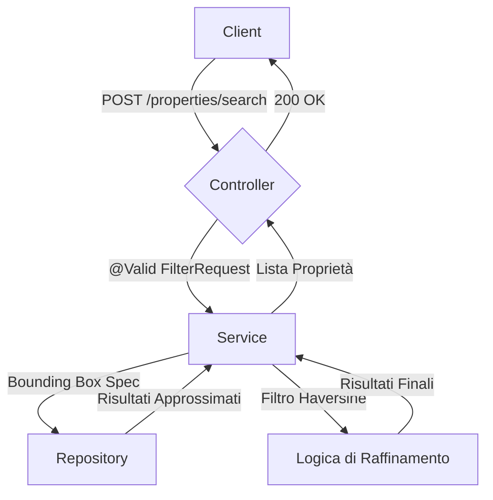

# Riprogettazione della Ricerca Immobili: Piano Architetturale

Questo documento descrive la riprogettazione della funzionalità di ricerca, passando da un modello ibrido (keyword + filtri) a un modello puramente geografico.

## 1. Nuova Architettura di Ricerca

La nuova architettura si basa esclusivamente su parametri geografici (latitudine, longitudine, raggio) come criteri di ricerca primari. La ricerca basata su `keyword` viene completamente rimossa.

### Flusso di Ricerca
Il flusso di ricerca seguirà questi passaggi:
1.  **Richiesta del Client**: Il client invia una richiesta `POST` all'endpoint `/properties/search` con un payload JSON contenente il `FilterRequest`.
2.  **Validazione Obbligatoria**: Il controller riceve la richiesta e il framework valida automaticamente che i parametri `centerLatitude`, `centerLongitude`, e `radiusInMeters` siano presenti e validi.
3.  **Query al Database (Fase 1 - Bounding Box)**: Il `PropertyQueryService` costruisce una `Specification` che filtra le proprietà all'interno di un "bounding box" approssimativo calcolato attorno al punto centrale. Questa è una query efficiente che restringe rapidamente il set di risultati a livello di database.
4.  **Raffinamento in Memoria (Fase 2 - Haversine)**: La lista di immobili ottenuta viene ulteriormente filtrata in memoria utilizzando la formula di Haversine per escludere i risultati che, pur essendo nel bounding box, si trovano al di fuori del raggio di ricerca circolare esatto.
5.  **Risposta al Client**: La lista finale e precisa degli immobili viene restituita al client.

## 2. Modifiche a DTO ed Endpoint

### DTO: `FilterRequest.java`
-   I campi `centerLatitude`, `centerLongitude`, e `radiusInMeters` saranno annotati con `@NotNull` per renderli obbligatori.
-   Il metodo `hasGeographicFilters()` verrà rimosso in quanto la validazione sarà gestita dal framework.

### Endpoint: `PropertiesController.java`
-   L'endpoint `POST /properties/search/{keyword}` verrà modificato in `POST /properties/search`.
-   Il `@PathVariable("keyword")` sarà rimosso dalla firma del metodo.

## 3. Giustificazione: Parametri Geografici nel Payload

La decisione di mantenere i parametri geografici (`centerLatitude`, `centerLongitude`, `radiusInMeters`) all'interno del payload (`FilterRequest`) anziché spostarli nell'URL come `@RequestParam` è basata sui seguenti principi:

1.  **Coerenza**: L'API utilizza già un DTO complesso per una moltitudine di filtri. Mantenere tutti i parametri di ricerca in un unico posto semplifica la gestione.
2.  **Manutenibilità**: Avere un singolo `FilterRequest` DTO rende il codice più pulito, più facile da leggere e da estendere in futuro. Evita firme di metodi con un numero eccessivo di parametri.
3.  **Validazione Semplificata**: Raggruppare tutti i filtri in un unico oggetto permette di sfruttare le annotazioni di validazione di Bean Validation in modo centralizzato e dichiarativo.

Sebbene una richiesta `GET` sia semanticamente più pura per le operazioni di ricerca, la complessità dei filtri rende l'uso di `POST` con un `@RequestBody` una scelta architetturale pragmatica e superiore in questo contesto.

## 4. Piano d'Azione per l'Implementazione

L'implementazione seguirà questi passaggi sequenziali:

1.  **Modificare `FilterRequest.java`**:
    -   Aggiungere `@NotNull` a `centerLatitude`, `centerLongitude`, `radiusInMeters`.
    -   Rimuovere il metodo `public boolean hasGeographicFilters()`.
2.  **Aggiornare `PropertiesController.java`**:
    -   Cambiare l'endpoint da `@PostMapping("/properties/search/{keyword}")` a `@PostMapping("/properties/search")`.
    -   Rimuovere il parametro `@PathVariable("keyword") String keyword` dalla firma del metodo `getProperties`.
    -   Aggiornare la chiamata al servizio: `propertyService.searchPropertiesWithFilters(filters)`.
3.  **Adattare `PropertyQueryService.java`**:
    -   Modificare la firma del metodo `searchPropertiesWithFilters` da `(String keyword, FilterRequest filters)` a `(FilterRequest filters)`.
    -   Rimuovere la chiamata `normalize(keyword)` e la validazione manuale dei filtri geografici, ora gestita da Bean Validation.
4.  **Semplificare `PropertySpecifications.java`**:
    -   Modificare la firma del metodo `withFilters` da `(String keyword, FilterRequest filters)` a `(FilterRequest filters)`.
    -   Rimuovere la chiamata al metodo `addKeywordPredicate`.
    -   Rimuovere il metodo `private static void addKeywordPredicate(...)`.

Questo piano garantisce una transizione fluida e a basso rischio verso la nuova architettura di ricerca.