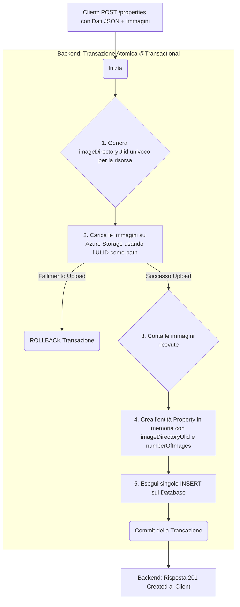

# Piano Architetturale: Gestione Immagini per Annunci Immobiliari

**Versione:** 1.1
**Data:** 2025-09-18
**Autore:** Luca Barrella

## 1. Sommario Esecutivo

Questo documento delinea l'architettura per il nuovo sistema di gestione delle immagini per la piattaforma DietiEstates. L'obiettivo è implementare una soluzione robusta, scalabile, efficiente e flessibile, che superi i limiti dell'attuale implementazione basata su `@ElementCollection` e si integri con un servizio di object storage esterno (Azure Blob Storage).

L'architettura proposta si basa su principi di disaccoppiamento, efficienza delle operazioni sul database e ottimizzazione delle risposte API per garantire alte prestazioni e manutenibilità a lungo termine.

---

## 2. Architettura e Flusso Dati

Il flusso di creazione di un nuovo immobile con immagini associate seguirà un approccio a singola transazione atomica per garantire l'integrità dei dati.

### Diagramma di Flusso della Creazione



---

## 3. Decisioni Architetturali e Compromessi (Trade-offs)

Ogni scelta architetturale è frutto di un'analisi costi-benefici. Di seguito sono documentate le decisioni chiave e le relative motivazioni.

### 3.1. Identificatore per Risorse Esterne: ULID

- **Decisione:** Invece di usare l'ID primario del database (`Long`) per nominare le cartelle su Azure, introdurremo una nuova colonna `image_directory_ulid` (`VARCHAR(26)`) nella tabella `property`. Questo ULID sarà generato dal backend prima di qualsiasi interazione con il database o lo storage.
- **Motivazione:** Questa scelta ci permette di conoscere un identificatore univoco per le immagini *prima* di salvare l'immobile, abilitando un flusso di creazione a singolo `INSERT` e rompendo la dipendenza circolare "ho bisogno dell'ID per creare il path, ma ho bisogno di salvare per avere l'ID". Il nome `imageDirectoryUlid` è stato scelto per chiarezza, combinando la funzione (directory per immagini) con il formato tecnico (ULID).
- **Compromesso (Trade-off):**
    - **Pro:** Abilita un flusso a singolo `INSERT`, più efficiente. Disaccoppia l'identificatore interno (PK) da quello esposto per le risorse. Gli ULID sono ordinabili lessicograficamente, il che può essere un vantaggio per il debug.
    - **Contro:** Aggiunge una colonna e un indice (`UNIQUE`) al database. La complessità è minima rispetto ai benefici.

### 3.2. Disaccoppiamento dello Storage: Pattern "Port & Adapter"

- **Decisione:** La logica di interazione con Azure Blob Storage non sarà implementata direttamente nei servizi di business. Creeremo un'interfaccia generica `FileStorageService` e un'implementazione concreta `AzureBlobStorageService`. I servizi di business dipenderanno solo dall'interfaccia.
- **Motivazione:** Questa astrazione rende il sistema agnostico rispetto al provider di storage. Se in futuro si decidesse di migrare ad Amazon S3 o un altro servizio, sarà sufficiente creare una nuova implementazione dell'interfaccia e modificare una singola riga nella configurazione di Spring, senza impattare il resto del codice.
- **Compromesso (Trade-off):**
    - **Pro:** Massima flessibilità e manutenibilità. Migliora drasticamente la testabilità del sistema (si possono usare implementazioni "mock" per i test).
    - **Contro:** Introduce un leggero livello di indirettezza (un'interfaccia e una classe in più), un costo di complessità ampiamente giustificato dai vantaggi.

### 3.3. URL delle Immagini: Costruzione Dinamica

- **Decisione:** Il database **non** memorizzerà l'URL completo o il base URL dello storage. Salveremo solo l'identificatore (`imageDirectoryUlid`) e il conteggio (`numberOfImages`). L'URL base dello storage (es. `https://myaccount.blob.core.windows.net/images`) sarà definito come una property nel file `application.properties`.
- **Motivazione:** Separare i dati (ULID) dalla configurazione dell'infrastruttura (URL base). Questo garantisce che una migrazione dello storage in futuro non richiederà alcuna modifica al database.
- **Compromesso (Trade-off):**
    - **Pro:** Architettura più pulita e disaccoppiata. Riduce la ridondanza dei dati nel database. Rende le migrazioni di infrastruttura trasparenti e a basso rischio.
    - **Contro:** Richiede al backend di assemblare dinamicamente gli URL ad ogni richiesta di lettura. Questo costo di CPU è assolutamente trascurabile.

### 3.4. Ottimizzazione per il Client: `numberOfImages` e Convenzione Numerica

- **Decisione:** Aggiungeremo una colonna `number_of_images` alla tabella `property`, con un vincolo `CHECK (number_of_images >= 1)`. Il backend la popolerà durante l'upload contando i file ricevuti. I file verranno nominati con una convenzione numerica a partire da zero (es. `0.webp`, `1.webp`, ...).
- **Motivazione:** Fornendo al client l'`imageDirectoryUlid` e il `numberOfImages`, il client può ricostruire tutti gli URL delle immagini in un ciclo `for`, senza fare chiamate API aggiuntive. La convenzione numerica (dove `0.webp` è l'immagine principale) è più semplice e robusta rispetto a nomi speciali come "main".
- **Compromesso (Trade-off):**
    - **Pro:** Migliora le prestazioni lato client, riduce i costi operativi e semplifica la logica di costruzione degli URL.
    - **Contro:** Aggiunge una colonna e un vincolo `CHECK` al database, un costo trascurabile a fronte dei benefici.

---

## 4. Piano di Implementazione Dettagliato

### Task 1: Modifica al Database
Creare un nuovo script di migrazione Flyway (es. `V5__add_image_management_columns.sql`).

```sql
ALTER TABLE property
ADD COLUMN image_directory_ulid VARCHAR(26) NOT NULL,
ADD COLUMN number_of_images INT NOT NULL DEFAULT 1;

ALTER TABLE property
ADD CONSTRAINT uk_property_image_directory_ulid UNIQUE (image_directory_ulid),
ADD CONSTRAINT chk_property_number_of_images CHECK (number_of_images >= 1);
```

### Task 2: Aggiornamento Entità e DTO
1.  **`Property.java`**: Aggiungere i nuovi campi all'entità.
    ```java
    package com.dieti.dietiestatesbackend.entities;
    //... altre importazioni
    import jakarta.persistence.Column;
    import jakarta.validation.constraints.Min;

    public abstract class Property extends BaseEntity {
        //... campi esistenti
        
        @Column(name = "image_directory_ulid", nullable = false, unique = true, length = 26)
        private String imageDirectoryUlid;

        @Min(1)
        @Column(name = "number_of_images", nullable = false)
        private int numberOfImages;
    }
    ```
2.  **`PropertyResponse.java`**: Semplificare i campi per ottimizzare la risposta.
    ```java
    package com.dieti.dietiestatesbackend.dto.response;
    //... altre importazioni

    public class PropertyResponse {
        //... campi esistenti
        private String imageDirectoryUlid;
        private int numberOfImages;
    }
    ```

### Task 3: Design Servizio di Storage
1.  Creare la nuova interfaccia in `src/main/java/com/dieti/dietiestatesbackend/service/storage/FileStorageService.java`:
    ```java
    package com.dieti.dietiestatesbackend.service.storage;

    import org.springframework.web.multipart.MultipartFile;
    import java.util.List;

    public interface FileStorageService {
        /**
         * Carica una lista di file in un percorso specifico.
         * @param path Il percorso (es. ULID della property) dove salvare i file.
         * @param files La lista di file da caricare.
         */
        void uploadImages(String path, List<MultipartFile> files);
    }
    ```
2.  Creare l'implementazione `AzureBlobStorageService.java` che implementa questa interfaccia.

### Task 4: Dipendenze e Configurazione
1.  **`pom.xml`**: Aggiungere le dipendenze per ULID e Azure.
    ```xml
    <!-- Per la generazione di ULID -->
    <dependency>
        <groupId>com.github.f4b6a3</groupId>
        <artifactId>ulid-creator</artifactId>
        <version>5.2.0</version>
    </dependency>
    <!-- Per Azure Blob Storage -->
    <dependency>
        <groupId>com.azure</groupId>
        <artifactId>azure-storage-blob</artifactId>
        <version>12.19.0</version>
    </dependency>
    ```
2.  **`application.properties`**: Aggiungere la configurazione per lo storage.
    ```properties
    # Azure Storage Configuration
    azure.storage.connection-string=[LA TUA CONNECTION STRING]
    azure.storage.container-name=images

    # Image Storage Base URL (usato per costruire le risposte API)
    storage.image.base-url=https://[NOME_ACCOUNT].blob.core.windows.net/[NOME_CONTAINER]
    ```

### Task 5: Modifica Endpoint `POST /properties`
In `PropertiesController.java`, modificare la firma del metodo `createProperty` per accettare un `multipart/form-data`.

```java
package com.dieti.dietiestatesbackend.controller;
// ... altre importazioni
import org.springframework.web.multipart.MultipartFile;
import org.springframework.http.MediaType;
import java.util.List;

@RestController
public class PropertiesController {
    // ... altri metodi e dipendenze

    @PostMapping(value = "/properties", consumes = { MediaType.MULTIPART_FORM_DATA_VALUE })
    public ResponseEntity<PropertyResponse> createProperty(
            @RequestPart("property") @Valid CreatePropertyRequest request,
            @RequestPart("images") List<MultipartFile> images,
            Authentication authentication) {
        // La logica effettiva sarà nel service
        PropertyResponse created = propertyService.createPropertyWithImages(request, images);
        return ResponseEntity.status(HttpStatus.CREATED).body(created);
    }
}
```

### Task 6: Aggiornamento Logica di Lettura API
Nel mapper responsabile della conversione da `Property` a `PropertyResponse`, implementare la logica di costruzione degli URL.

```java
package com.dieti.dietiestatesbackend.mappers;
// ... altre importazioni

// Esempio concettuale di come il mapper potrebbe essere implementato
@Component
public class PropertyResponseMapper {

    public PropertyResponse toResponse(Property property) {
        PropertyResponse response = new PropertyResponse();
        // Mappare tutti i campi da property a response...
        
        response.setImageDirectoryUlid(property.getImageDirectoryUlid());
        response.setNumberOfImages(property.getNumberOfImages());
        
        return response;
    }
}
```

### Task 7: Validazione delle Immagini
Nel `FileStorageService`, implementare la validazione per ogni file caricato:
- **Formato:** Consentire solo `image/webp`, `image/jpeg`, `image/png`.
- **Dimensione:** Impostare un limite massimo per file (es. 5 MB).
- **Numero:** Limitare il numero totale di immagini per annuncio (es. 20).

### Task 8: Migrazione Dati Esistenti (Opzionale)
Se necessario, creare uno script o un servizio di migrazione una tantum per:
1.  Leggere le immagini esistenti dalla tabella `property_images`.
2.  Generare un `imageDirectoryUlid` per ogni `Property` esistente.
3.  Caricare le immagini su Azure nella nuova struttura di cartelle.
4.  Popolare i campi `image_directory_ulid` e `number_of_images`.
5.  Questo task va pianificato con attenzione per evitare downtime.

### Task 9: Deprecare e Rimuovere la Vecchia Gestione Immagini
Una volta che la nuova logica è funzionante, testata e i dati sono stati migrati:
1.  Rimuovere l'endpoint `GET /thumbnails/{id}` da `PropertiesController`.
2.  Rimuovere la dipendenza e l'uso di `PropertyImageUtils`.
3.  Rimuovere la collezione `@ElementCollection private List<String> images;` dall'entità `Property`.
4.  Creare uno script di migrazione Flyway per eliminare la tabella `property_images` dal database.

---

## 5. Conclusione

L'architettura finale è il risultato di un'analisi iterativa che ha massimizzato la flessibilità, l'efficienza e la manutenibilità del sistema. Seguendo questo piano, implementeremo una soluzione di gestione delle immagini di livello professionale, pronta a scalare e ad adattarsi a future esigenze tecnologiche.