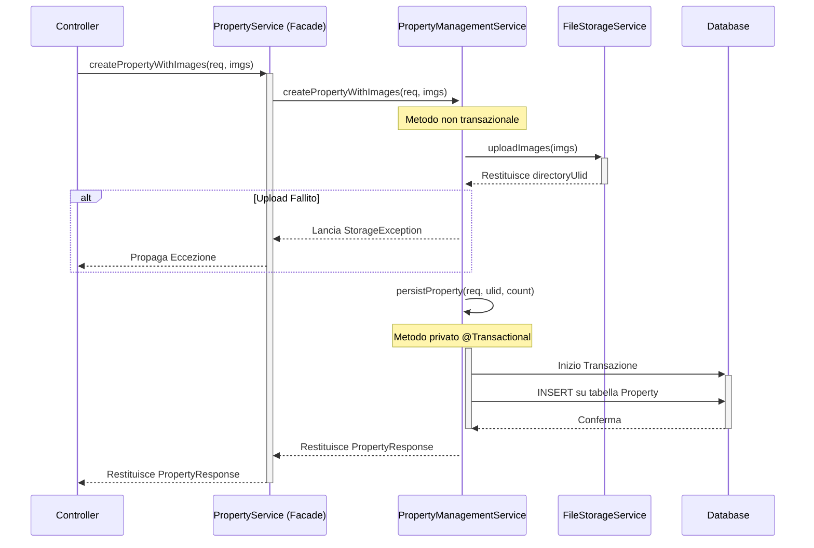
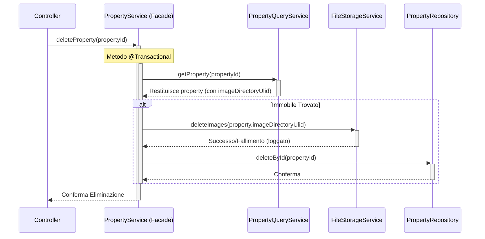

# Piano di Refactoring Architetturale per la Gestione delle Immagini (Versione Finale)

## 1. Introduzione
Questo documento delinea il piano di refactoring per risolvere le criticità architetturali nella gestione delle immagini e delle transazioni, incorporando i feedback emersi durante la revisione del piano.

Le modifiche principali si concentrano su:
- **Separazione delle Responsabilità:** Spostare la logica di validazione e di orchestrazione fuori dai servizi di storage.
- **Gestione Robusta delle Transazioni:** Evitare transazioni di lunga durata che includono operazioni di I/O di rete.
- **Atomicità delle Operazioni:** Garantire che l'upload e la cancellazione di più file avvengano in modo atomico (tutto o niente).
- **Semplificazione della Gerarchia:** Rimuovere classi astratte non più necessarie.
- **Riutilizzo della Logica:** Centralizzare la logica di eliminazione delle immagini.

---

## 2. Architettura Proposta (Revisionata)

### 2.1. Rimozione della Classe Astratta `AbstractFileStorageService`
La classe astratta `AbstractFileStorageService` viene rimossa. La sua responsabilità iniziale (validazione e controlli comuni) è stata spostata nel service orchestratore. `AzureBlobStorageService` implementerà direttamente l'interfaccia `FileStorageService`, semplificando la gerarchia delle classi.

### 2.2. Flusso di Creazione della Proprietà
Il flusso di creazione viene orchestrato per separare l'upload dalla transazione DB, con `PropertyService` che agisce da Facade.



### 2.3. Flusso di Eliminazione della Proprietà (Revisionato)
Viene introdotto un flusso orchestrato per l'eliminazione, che garantisce la rimozione sia dei dati dal DB sia dei file dallo storage.



---

## 3. Piano di Implementazione Dettagliato

### 3.1. Rimuovere `AbstractFileStorageService` e Aggiornare `AzureBlobStorageService`

1.  **Eliminare il file:** `src/main/java/com/dieti/dietiestatesbackend/service/storage/AbstractFileStorageService.java`.
2.  **Modificare `AzureBlobStorageService.java`:**
    *   Cambiare la dichiarazione della classe in `public class AzureBlobStorageService implements FileStorageService`.
    *   Spostare la logica di controllo (check sul numero massimo di immagini) direttamente nel metodo `uploadImages`.

    ```java
    // in AzureBlobStorageService.java
    @Service
    public class AzureBlobStorageService implements FileStorageService {
        
        private static final Logger logger = LoggerFactory.getLogger(AzureBlobStorageService.class);

        @Value("${azure.storage.connection-string}")
        private String connectionString;
    
        @Value("${azure.storage.container-name}")
        private String containerName;

        @Value("${storage.image.max-images-per-property:20}") // Default a 20 se non specificato
        private int maxImagesPerProperty;
        
        private BlobContainerClient blobContainerClient;

        @PostConstruct
        public void initialize() {
            BlobServiceClient client = new BlobServiceClientBuilder().connectionString(connectionString).buildClient();
            this.blobContainerClient = client.getBlobContainerClient(containerName);
            if (!blobContainerClient.exists()) {
                blobContainerClient.create();
            }
        }

        @Override
        public boolean uploadImages(String directoryUlid, List<MultipartFile> files) {
            if (files == null || files.isEmpty()) {
                return true;
            }
            if (files.size() > maxImagesPerProperty) {
                logger.error("Tentativo di caricare {} immagini, ma il massimo consentito è {}.", files.size(), maxImagesPerProperty);
                return false;
            }
            return doUploadImages(directoryUlid, files);
        }
        
        @Override
        public boolean deleteImages(String directoryUlid) {
            logger.info("Avvio eliminazione immagini per la directory: {}", directoryUlid);
            boolean allDeletionsSuccessful = true;
            try {
                for (BlobItem blobItem : blobContainerClient.listBlobsByHierarchy(directoryUlid + "/")) {
                    BlobClient blobClient = blobContainerClient.getBlobClient(blobItem.getName());
                    blobClient.delete();
                    logger.debug("Blob eliminato: {}", blobItem.getName());
                }
            } catch (Exception e) {
                logger.error("Errore durante l'eliminazione dei blob per la directory {}: {}", directoryUlid, e.getMessage(), e);
                allDeletionsSuccessful = false;
            }
            return allDeletionsSuccessful;
        }

        private boolean doUploadImages(String directoryUlid, List<MultipartFile> files) {
            // Implementazione con logica di rollback atomico
            // (Vedi sezione 3.3 per il codice dettagliato)
            return true;
        }
    }
    ```

### 3.2. Implementare la Gestione della Transazione (Transaction-Last)

1.  **Modificare `PropertyManagementService.java`:**
    *   Rimuovere `@Transactional` a livello di classe.
    *   Implementare il metodo pubblico `createPropertyWithImages` come orchestratore non transazionale.
    *   Creare il metodo privato `persistProperty` annotato con `@Transactional`.
    *   Nel blocco `catch` del metodo pubblico, richiamare `fileStorageService.deleteImages` per la compensazione.

### 3.3. Garantire l'Atomicità dell'Upload

1.  **Modificare `AzureBlobStorageService.java`:**
    *   Sostituire `doUploadImages` con un'implementazione che tracci gli upload riusciti e gestisca il rollback.

    ```java
    // in AzureBlobStorageService.java
    private boolean doUploadImages(String directoryUlid, List<MultipartFile> files) {
        HttpClient httpClient = HttpClient.newHttpClient();
        List<String> uploadedBlobNames = new ArrayList<>();

        for (int i = 0; i < files.size(); i++) {
            MultipartFile file = files.get(i);
            String blobName = directoryUlid + "/" + i + ".webp";
            
            if (uploadSingleFileWithSas(httpClient, file, blobName)) {
                uploadedBlobNames.add(blobName);
            } else {
                logger.warn("Upload fallito per {}, avvio rollback per {} file già caricati.", blobName, uploadedBlobNames.size());
                for (String blobToDelete : uploadedBlobNames) {
                    try {
                        blobContainerClient.getBlobClient(blobToDelete).delete();
                        logger.info("Rollback: blob {} eliminato.", blobToDelete);
                    } catch (Exception e) {
                        logger.error("FALLIMENTO ROLLBACK: Impossibile eliminare il blob {}.", blobToDelete, e);
                    }
                }
                return false;
            }
        }
        return true;
    }

    private boolean uploadSingleFileWithSas(HttpClient httpClient, MultipartFile file, String blobName) {
        // Logica per generare la SAS URL e caricare il singolo file...
        // Restituisce true in caso di successo, false altrimenti.
        return true; 
    }
    ```

### 3.4. Refactoring della Logica di Eliminazione

1.  **Modificare `PropertyService.java`:**
    *   Annotare il metodo `deleteProperty` con `@Transactional`.
    *   Modificare l'implementazione per orchestrare l'eliminazione dei file e dell'entità.

    ```java
    // in PropertyService.java
    @Transactional
    public void deleteProperty(Long id) {
        Property property = propertyQueryService.findPropertyById(id)
            .orElse(null);

        if (property != null) {
            if (property.getImageDirectoryUlid() != null && !property.getImageDirectoryUlid().isBlank()) {
                logger.info("Avvio eliminazione immagini per la proprietà {} (ULID: {})", id, property.getImageDirectoryUlid());
                boolean deleteSuccess = fileStorageService.deleteImages(property.getImageDirectoryUlid());
                if (!deleteSuccess) {
                    logger.warn("L'eliminazione delle immagini per la proprietà {} è fallita, ma si procederà con l'eliminazione dal DB.", id);
                }
            }
            
            propertyRepository.deleteById(id);
            logger.info("Proprietà con ID {} eliminata con successo.", id);
        } else {
            logger.warn("Tentativo di eliminare una proprietà non esistente con ID: {}", id);
        }
    }
    ```

### 3.5. Propagare Correttamente le Eccezioni
1.  **Modificare `PropertyManagementService.java`:**
    *   Assicurarsi che il blocco `catch` nel metodo `createPropertyWithImages` rilanci l'eccezione originale (`throw dbException;`) dopo aver tentato la compensazione.

---

## 4. Conclusione
Questo piano aggiornato produce un'architettura più semplice, robusta e manutenibile, risolvendo le criticità identificate e incorporando i miglioramenti suggeriti.
