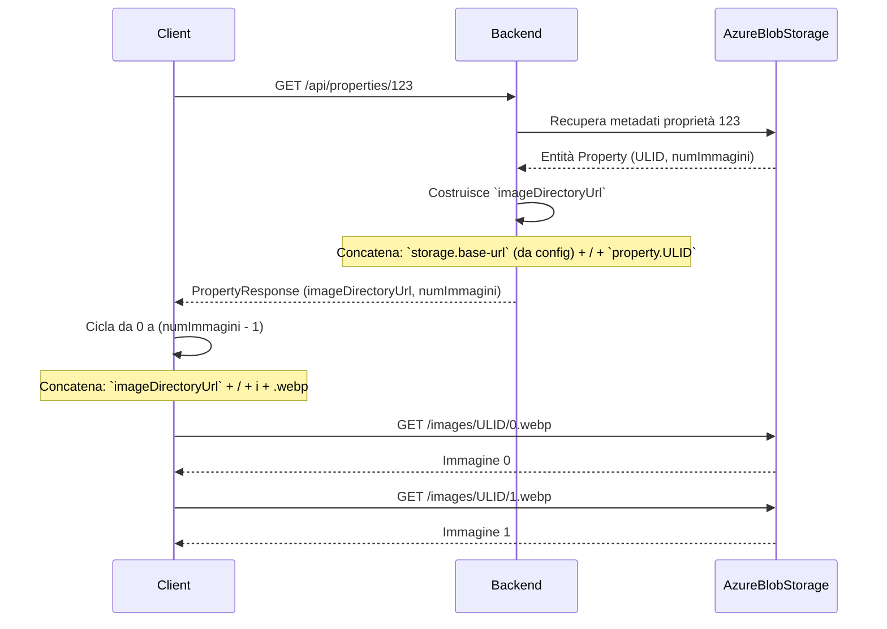

# Analisi Architetturale: Gestione URL Immagini nel Contratto API

Questo documento finalizza la strategia per la gestione degli URL delle immagini nelle risposte API, basandosi su un'analisi iterativa dei requisiti di flessibilità, manutenibilità e semplicità.

---

## Strategia Raccomandata e Finale

La strategia scelta è un approccio ibrido che bilancia il disaccoppiamento con la semplicità del contratto API. Il backend fornirà un URL pre-costruito che punta alla directory specifica dell'annuncio, lasciando al client solo il compito di iterare sui nomi dei file.

**Payload Finale:**
```json
{
  "imageDirectoryUrl": "https://dietiestates.blob.core.windows.net/images/01H8XGJWBWBAQ4Z4E1B4N1V3GZ",
  "numberOfImages": 3
}
```

Il client esegue una semplice operazione di concatenazione e iterazione per ogni immagine:
`URL_immagine = imageDirectoryUrl + "/" + index + ".webp"`

### Vantaggi di Questa Strategia

*   **Disaccoppiamento dall'Infrastruttura:** Il client non conosce l'URL base dello storage (es. `https://dietiestates.blob.core.windows.net/images`). Se il backend decide di cambiare il CDN o il provider, modificherà semplicemente il valore di `imageDirectoryUrl` restituito. Il client non necessita di alcun aggiornamento.
*   **Contratto API Pulito e Semplice:** Il payload è conciso e non contiene informazioni ridondanti, dato che si assume un unico provider di storage per tutte le immagini.
*   **Logica Client Minimale e Stabile:** La responsabilità del client è limitata a una semplice e stabile convenzione di naming (`/index.webp`), un compromesso a basso rischio e facilmente gestibile.

### Svantaggi Accettati

*   **Accoppiamento sulla Convenzione di Naming:** Esiste un leggero accoppiamento sulla struttura dei nomi dei file. Questo è considerato un rischio minimo e un compromesso accettabile per i vantaggi ottenuti in termini di semplicità e disaccoppiamento.

---

## Diagramma di Flusso Finale



---

## Conclusione

La strategia finale, basata su un payload con `imageDirectoryUrl` e `numberOfImages`, è la soluzione ottimale per il progetto. Offre il miglior equilibrio tra disaccoppiamento, manutenibilità e semplicità, allineandosi perfettamente con i requisiti discussi.