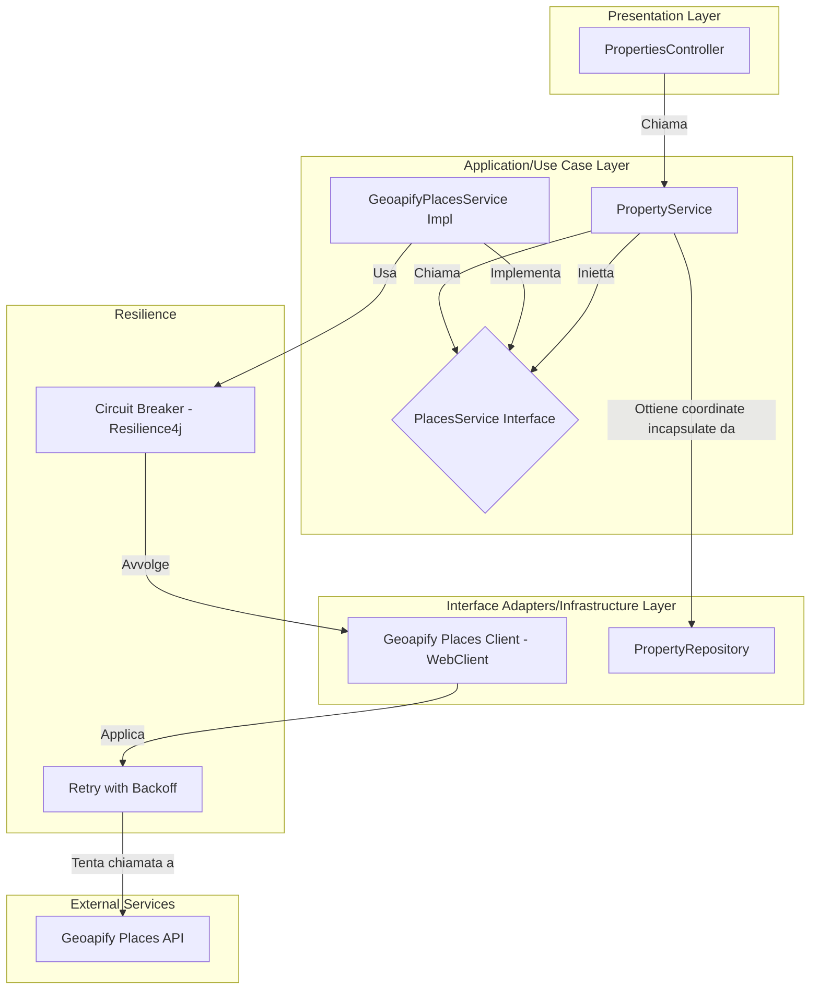

# Piano Architetturale: Integrazione Geopify Places

## 1. Obiettivo

Integrare il servizio "Places" di Geoapify per trovare punti di interesse (POI) nelle vicinanze di un immobile. L'obiettivo è fornire agli utenti informazioni contestuali rilevanti come scuole, parchi, trasporti pubblici e altri servizi, migliorando l'esperienza utente.

L'architettura seguirà i principi di Clean Architecture, SoC e SOLID, garantendo manutenibilità, testabilità e scalabilità.

## 2. Architettura e Flusso dei Dati

L'integrazione introduce un nuovo servizio, `PlacesService`, che astrae la logica di ricerca dei POI. Per rispettare il **Principio della Legge di Demetra (LoD)**, il `PropertyService` non accederà più direttamente al repository per le coordinate, ma utilizzerà un metodo incapsulato per recuperarle.

### Diagramma Architetturale



### Flusso dei Dati

1.  Il client invia una richiesta a `GET /api/properties/{id}/places`.
2.  `PropertiesController` riceve la richiesta.
3.  Il controller chiama un metodo del `PropertyService` per avviare la ricerca.
4.  Il `PropertyService` ottiene le coordinate dell'immobile in modo incapsulato, senza esporre i dettagli del `PropertyRepository`.
5.  Il `PropertyService` invoca il `PlacesService` passando coordinate, raggio e categorie.
6.  `GeoapifyPlacesService` (implementazione concreta) esegue la richiesta all'API di Geoapify.
    -   La chiamata è protetta da un **Circuit Breaker** (Resilience4j).
    -   In caso di errori transitori (es. 429 Too Many Requests), viene applicata una strategia di **retry con backoff esponenziale**.
7.  Se l'API fallisce persistentemente e il circuit breaker si apre, viene attivata una **fallback strategy** (es. restituire una lista vuota).
8.  L'API di Geoapify restituisce un GeoJSON con i luoghi trovati.
9.  Il servizio mappa la risposta in una lista di `PlaceDTO`.
10. La lista viene restituita al controller e, infine, al client.

## 3. Componenti Chiave

### 3.1. Service Layer

-   **`PlacesService.java` (Interfaccia)**:
    ```java
    public interface PlacesService {
        List<PlaceDTO> findNearbyPlaces(Coordinates coordinates, int radius, List<String> categories);
    }
    ```
-   **`GeoapifyPlacesService.java` (Implementazione)**: Implementa `PlacesService`, gestisce la logica di interazione con l'API, il caching, la resilienza e la gestione degli errori.

### 3.2. Controller

-   **`GET /api/properties/{id}/places`**:
    -   **Path Variable**: `id` (ID dell'immobile).
    -   **Query Params**: `radius` (default: 1000m), `categories` (default: "essenziali").

### 3.3. Modelli di Dati (DTO)

-   **`GeoapifyPlacesResponse.java`**: DTO per deserializzare la risposta JSON di Geoapify.
-   **`PlaceDTO.java`**: DTO snello per il client.
    ```java
    public class PlaceDTO {
        private String name;
        private String category;
        private int distance; // in metri
        private double latitude;
        private double longitude;
    }
    ```

## 4. Configurazione

La configurazione sarà estesa in `GeocodingProperties` per includere l'URL dell'API Places.

-   **`application.properties`**:
    ```properties
    # Geoapify Places API
    geocoding.provider.geoapify.places-api-url=https://api.geoapify.com/v2/places
    ```
-   **`GeocodingProperties.java`**:
    ```java
    public static class Geoapify {
        // ... altre proprietà
        private String placesApiUrl; // NUOVO
        // getter e setter
    }
    ```

## 5. Caching

La strategia di caching verrà migliorata per garantire una chiave deterministica e affidabile.

-   **Cache**: `"places"`.
-   **Chiave Deterministica**: La chiave sarà generata ordinando le categorie e unendole, per evitare che lo stesso set di categorie in ordine diverso produca chiavi differenti.
    ```java
    @Cacheable(value = "places", keyGenerator = "placesCacheKeyGenerator")
    public List<PlaceDTO> findNearbyPlaces(Coordinates coordinates, int radius, List<String> categories) {
        // ... logica di chiamata API
    }
    ```
-   **`CacheKeyGenerator` Custom**: Verrà creato un bean `placesCacheKeyGenerator` che implementa la logica di ordinamento e join delle categorie per generare la chiave.

## 6. Gestione degli Errori e Resilienza

La gestione degli errori sarà resa più specifica e robusta.

### 6.1. Eccezioni Specifiche

Invece di una generica `PlacesException`, verranno introdotte eccezioni specifiche per scenari di errore distinti:
-   `GeoapifyApiException`: Per errori generici dell'API (es. 5xx).
-   `InvalidRequestException`: Per errori di richiesta del client (es. 4xx, parametri non validi).
-   `ServiceUnavailableException`: Quando il servizio non è raggiungibile o il circuit breaker è aperto.

### 6.2. Resilienza con Resilience4j

-   **Circuit Breaker**: Verrà configurato un `CircuitBreaker` sul `GeoapifyPlacesService` per interrompere le chiamate in caso di fallimenti ripetuti, prevenendo il sovraccarico del sistema.
-   **Fallback Strategy**: In caso di circuito aperto o fallimento non recuperabile, il servizio restituirà una fallback (es. lista vuota o dati da una cache secondaria/statica).
-   **Rate Limiting e Retry**: Per gestire il rate limiting dell'API di Geoapify (HTTP 429), verrà implementato un meccanismo di **retry con backoff esponenziale**. Questo tenterà di eseguire nuovamente la chiamata dopo un ritardo crescente, evitando di sovraccaricare l'API.

## 7. Aderenza alla Legge di Demetra (LoD)

Per rispettare il principio LoD, il `PropertyService` non dovrà più conoscere i dettagli implementativi del `PropertyRepository` per ottenere le coordinate.

-   **Incapsulamento**: Verrà introdotto un metodo `getCoordinatesByPropertyId(Long propertyId)` nel `PropertyService` (o in un servizio dedicato come `CoordinatesService` se la logica cresce). Questo metodo conterrà la logica per recuperare le coordinate, nascondendo la dipendenza diretta dal repository al chiamante.
