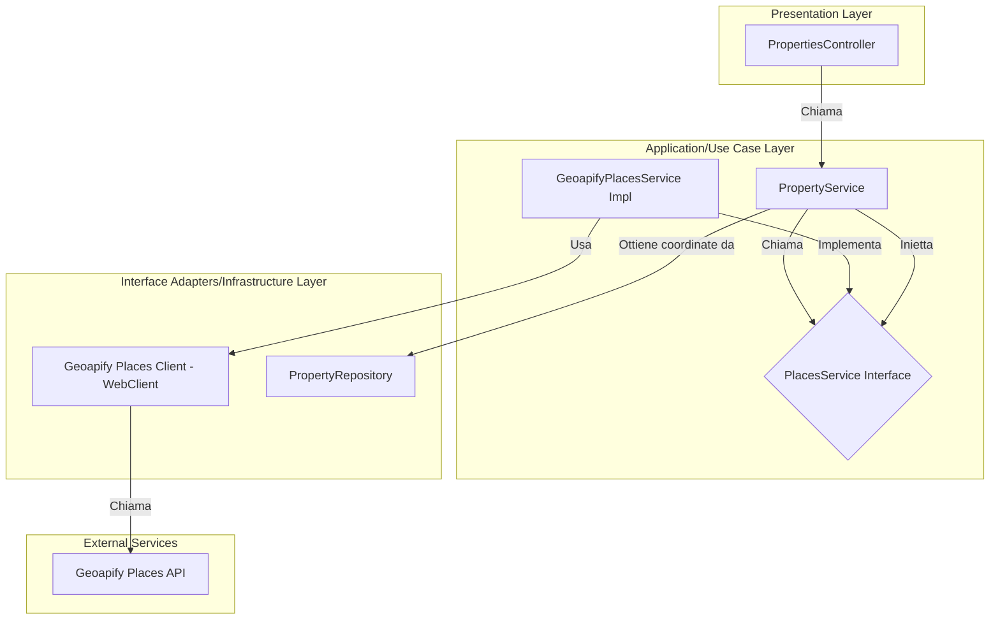

# Piano Architetturale Semplificato: Integrazione Geopify Places

## 1. Obiettivo

Integrare il servizio "Places" di Geoapify per trovare punti di interesse (POI) nelle vicinanze di un immobile. L'obiettivo è fornire agli utenti informazioni contestuali rilevanti, seguendo i principi di Clean Architecture, SoC e SOLID per garantire manutenibilità e scalabilità.

Questa versione del piano è stata **semplificata** per concentrarsi sulla funzionalità di base, posticipando meccanismi complessi in linea con i principi YAGNI e KISS.

## 2. Architettura e Flusso dei Dati (Semplificato)

L'architettura mantiene la separazione dei layer ma rimuove la complessità legata alla resilienza avanzata, che potrà essere introdotta in futuro.

### Diagramma Architetturale Semplificato



### Flusso dei Dati Semplificato

1.  Il client invia una richiesta a `GET /api/properties/{id}/places`.
2.  `PropertiesController` riceve la richiesta e chiama il `PropertyService`.
3.  `PropertyService` ottiene le coordinate dell'immobile e invoca `PlacesService.findNearbyPlaces(...)`.
4.  `GeoapifyPlacesService` (implementazione) utilizza `WebClient` per chiamare l'API di Geoapify.
5.  **Gestione Errori Semplice**: Se la chiamata API fallisce, viene lanciata un'eccezione `PlacesServiceException` che verrà gestita globalmente da `GlobalExceptionHandler`.
6.  La risposta JSON viene deserializzata in modo **typesafe** in DTO specifici (`GeoapifyPlacesResponse`), evitando l'uso di `instanceof`.
7.  Il servizio mappa i risultati in una lista di `PlaceDTO` e la restituisce.

## 3. Decisioni Chiave di Semplificazione

*   **Resilienza**: **Posticipata**. Non verranno implementati `Resilience4j` (Circuit Breaker, Retry). La gestione degli errori di rete si affida al comportamento standard di `WebClient`.
*   **Gestione Errori**: Si utilizzerà una singola eccezione custom, `PlacesServiceException`, per incapsulare tutti gli errori relativi all'interazione con Geopify.
*   **Caching**: Si utilizzerà l'annotazione `@Cacheable` standard di Spring senza un `keyGenerator` custom per la fase iniziale.
*   **Legge di Demetra (LoD)**: Il principio viene rispettato. Il `PropertyService` incapsula la logica di recupero delle coordinate, non esponendo il `PropertyRepository` ai suoi chiamanti.

## 4. Componenti Chiave

### 4.1. Service Layer

-   **`PlacesService.java` (Interfaccia)**:
    ```java
    public interface PlacesService {
        List<PlaceDTO> findNearbyPlaces(Coordinates coordinates, int radius, List<String> categories);
    }
    ```
-   **`GeoapifyPlacesService.java` (Implementazione)**: Implementa `PlacesService` e contiene la logica di chiamata all'API tramite `WebClient`.

### 4.2. Controller

-   **`GET /api/properties/{id}/places`**:
    -   **Path Variable**: `id` (ID dell'immobile).
    -   **Query Params**: `radius` (default: 1000m), `categories` (default: "essenziali").

### 4.3. Modelli di Dati (DTO)

-   **`GeoapifyPlacesResponse.java`**: DTO per deserializzare la risposta JSON completa di Geoapify in modo typesafe.
-   **`PlaceDTO.java`**: DTO snello esposto al client.
    ```java
    public class PlaceDTO {
        private String name;
        private String category;
        private int distance; // in metri
        private double latitude;
        private double longitude;
    }
    ```

## 5. Configurazione

La configurazione verrà estesa per includere l'URL dell'API Places.

-   **`application.properties`**:
    ```properties
    geocoding.provider.geoapify.places-api-url=https://api.geoapify.com/v2/places
    ```
-   **`GeoapifyConfig.java`**:
    ```java
    public class GeoapifyConfig {
        // ... altre proprietà
        private String placesApiUrl;
        // getter e setter
    }
    ```


## 7. Aderenza alla Legge di Demetra (LoD)

Per rispettare il principio LoD, il `PropertyService` non dovrà più conoscere i dettagli implementativi del `PropertyRepository` per ottenere le coordinate.

-   **Incapsulamento**: Verrà introdotto un metodo `getCoordinatesByPropertyId(Long propertyId)` nel `PropertyService` (o in un servizio dedicato come `CoordinatesService` se la logica cresce). Questo metodo conterrà la logica per recuperare le coordinate, nascondendo la dipendenza diretta dal repository al chiamante.

## 8. Roadmap di Implementazione

La seguente To-Do list guiderà lo sviluppo:

- [ ] Definire i DTO per la risposta di Geopify Places.
- [ ] Creare l'interfaccia `PlacesService`.
- [ ] Implementare `GeoapifyPlacesService` con `WebClient`.
- [ ] Definire e gestire `PlacesServiceException` nel `GlobalExceptionHandler`.
- [ ] Integrare `PlacesService` nel `PropertyService`.
- [ ] Creare l'endpoint nel `PropertiesController`.
- [ ] Aggiungere la configurazione per l'URL dell'API Places.
