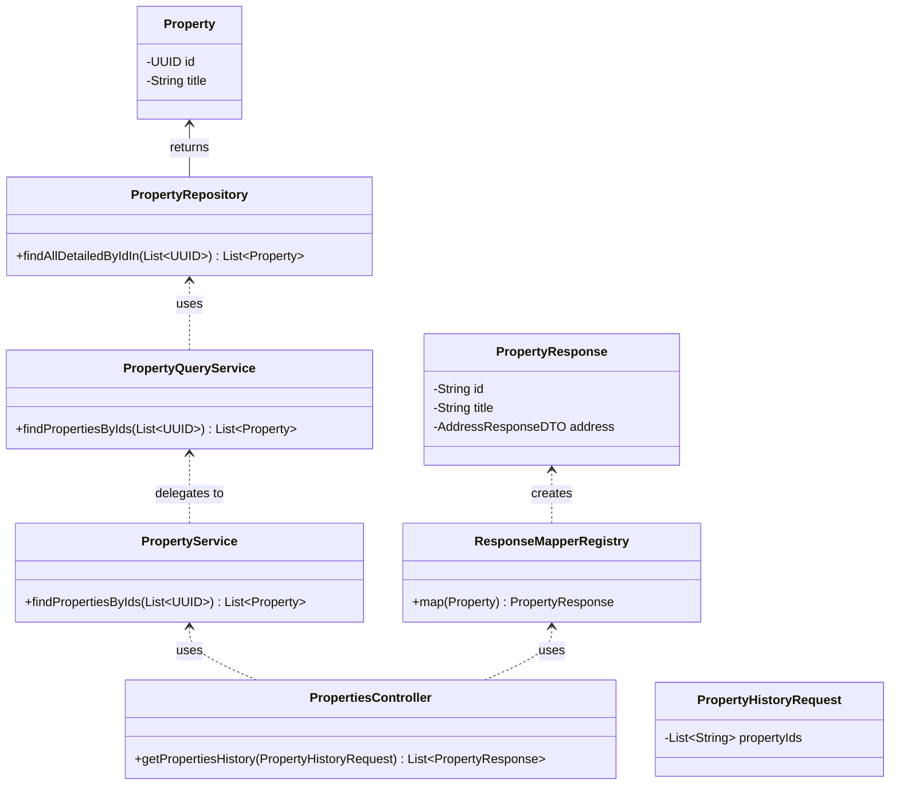

# Piano di Implementazione per la Funzionalità "Cronologia Immobili"

## Riepilogo

Questo documento delinea il piano tecnico per l'implementazione dell'endpoint `POST /api/properties/history`, come definito nella proposta API e rivisto in base al feedback ricevuto. L'obiettivo è recuperare i dettagli di una lista di immobili tramite i loro ID, riutilizzando l'architettura e i DTO di risposta esistenti per garantire coerenza.

## Architettura e Flusso Dati

Il design si basa sul pattern Façade e Service Layer già presente nel progetto:

1.  **`PropertiesController`**: Riceve la richiesta HTTP, la valida e invoca la facciata `PropertyService`.
2.  **`PropertyService`**: Agisce come entry-point, delegando la logica di query a `PropertyQueryService`.
3.  **`PropertyQueryService`**: Esegue la logica di recupero dati, interfacciandosi con il `PropertyRepository`.
4.  **`PropertyRepository`**: Esegue la query sul database per trovare gli immobili tramite una lista di ID, utilizzando fetch join per caricare le relazioni in modo efficiente.
5.  **`ResponseMapperRegistry`**: Al ritorno nel controller, il registry di mapper esistente viene utilizzato per convertire le entità `Property` nei `PropertyResponse` DTO, garantendo che la struttura della risposta sia identica a quella della ricerca.

### Diagramma delle Classi

## Piano di Implementazione Dettagliato

I seguenti passaggi verranno eseguiti per implementare la funzionalità:

1.  **Creare il DTO per la richiesta**:
    *   **File**: `src/main/java/com/dieti/dietiestatesbackend/dto/request/PropertyHistoryRequest.java`
    *   **Contenuto**: Una classe POJO con un singolo campo `List<String> propertyIds`, annotato con `@NotEmpty` per la validazione.

2.  **Aggiungere un metodo al `PropertyRepository`**:
    *   **File**: `src/main/java/com/dieti/dietiestatesbackend/repositories/PropertyRepository.java`
    *   **Azione**: Aggiungere un metodo con una query JPQL che utilizzi `JOIN FETCH` per caricare in modo eager le relazioni (`address`, `agent`, `propertyCategory`, `contract`) per una lista di ID.
    *   **Esempio di firma**: `List<Property> findAllDetailedByIdIn(List<UUID> ids);`

3.  **Implementare il metodo in `PropertyQueryService`**:
    *   **File**: `src/main/java/com/dieti/dietiestatesbackend/service/PropertyQueryService.java`
    *   **Azione**: Creare il metodo `findPropertiesByIds(List<UUID> ids)` che invoca il nuovo metodo del repository.

4.  **Implementare il metodo in `PropertyService`**:
    *   **File**: `src/main/java/com/dieti/dietiestatesbackend/service/PropertyService.java`
    *   **Azione**: Creare il metodo `findPropertiesByIds(List<UUID> ids)` che funge da facciata, delegando la chiamata a `propertyQueryService`.

5.  **Aggiungere il nuovo endpoint in `PropertiesController`**:
    *   **File**: `src/main/java/com/dieti/dietiestatesbackend/controller/PropertiesController.java`
    *   **Azione**: Creare un metodo annotato con `@PostMapping("/properties/history")`. Questo metodo:
        *   Accetta `@Valid @RequestBody PropertyHistoryRequest`.
        *   Converte gli ID da `String` a `UUID`.
        *   Chiama `propertyService.findPropertiesByIds(...)`.
        *   Mappa la lista di entità risultante in `List<PropertyResponse>` usando `responseMapperRegistry`.
        *   Restituisce `ResponseEntity.ok()` con la lista di DTO.

6.  **Scrivere test di integrazione**:
    *   **Azione**: Creare un test che simuli una richiesta POST a `/api/properties/history` con un set di ID noti e verifichi che la risposta sia `200 OK`, contenga il numero corretto di immobili e che i dati siano mappati correttamente nel formato `PropertyResponse`.