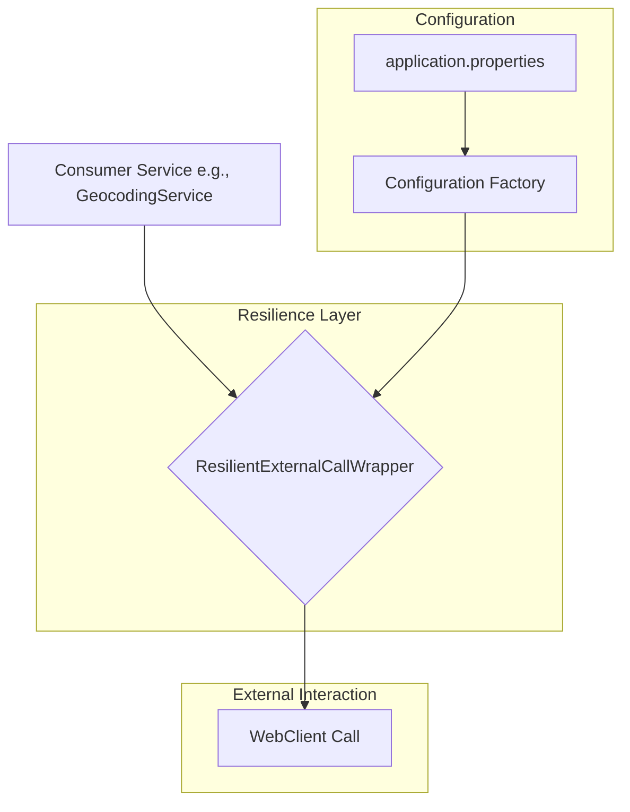

# Piano Architetturale: Meccanismo di Retry e Circuit Breaker Generico

Questo documento descrive l'architettura per un meccanismo di resilienza generico e riutilizzabile per le chiamate a servizi esterni, basato su **Resilience4j** e integrato con **Spring WebFlux**.

## 1. Aggiunta delle Dipendenze

Per abilitare le funzionalità di Resilience4j in un progetto Spring Boot 3.x, è necessario aggiungere le seguenti dipendenze al file `pom.xml`. Queste dipendenze forniscono l'integrazione con il circuit breaker di Spring Cloud e il supporto per l'ambiente reattivo di Project Reactor.

```xml
<dependencyManagement>
    <dependencies>
        <dependency>
            <groupId>org.springframework.cloud</groupId>
            <artifactId>spring-cloud-dependencies</artifactId>
            <version>2023.0.0</version> <!-- Usa una versione compatibile con Spring Boot 3.5.4 -->
            <type>pom</type>
            <scope>import</scope>
        </dependency>
    </dependencies>
</dependencyManagement>

<dependencies>
    <!-- Abilita l'integrazione con Spring Cloud Circuit Breaker -->
    <dependency>
        <groupId>org.springframework.cloud</groupId>
        <artifactId>spring-cloud-starter-circuitbreaker-resilience4j</artifactId>
    </dependency>

    <!-- Fornisce gli operatori per l'integrazione con Project Reactor (Mono/Flux) -->
    <dependency>
        <groupId>io.github.resilience4j</groupId>
        <artifactId>resilience4j-reactor</artifactId>
    </dependency>
    
    <!-- Necessario per la configurazione tramite application.properties -->
    <dependency>
        <groupId>org.springframework.boot</groupId>
        <artifactId>spring-boot-starter-aop</artifactId>
    </dependency>
</dependencies>
```

## 2. Architettura dei Componenti Chiave

Proponiamo un'architettura basata su un wrapper programmatico che offre la massima flessibilità e si integra nativamente con l'API funzionale di WebFlux.



I componenti principali sono:

*   **`ResilientExternalCallWrapper`**: Un servizio Spring (`@Service`) generico che funge da wrapper per le chiamate esterne. Sarà il cuore della nostra logica di resilienza. Esporrà un metodo che accetta un `Mono<T>` o `Flux<T>` (la chiamata `WebClient` originale) e un identificatore di configurazione. Il wrapper applicherà dinamicamente le policy di Retry e Circuit Breaker appropriate.

*   **`Configuration Factory/Registry`**: Resilience4j, tramite l'auto-configurazione di Spring Boot, crea un `CircuitBreakerRegistry` e un `RetryRegistry`. Questi registry contengono le istanze configurate dei circuit breaker e dei meccanismi di retry, lette direttamente dal file `application.properties`. Il nostro wrapper utilizzerà questi registry per recuperare le policy corrette in base a un nome (es. "geocoding-api", "payment-gateway").

*   **Configurazione Esterna (`application.properties`)**: La configurazione delle policy di resilienza sarà centralizzata e gestita tramite properties, permettendo modifiche senza ricompilare il codice. Sarà possibile definire configurazioni di default e configurazioni specifiche per ogni servizio esterno.

Questo approccio disaccoppia la logica di business dalla logica di resilienza, rendendo il sistema più manutenibile e scalabile.
## 3. Meccanismo di Retry

Il meccanismo di retry è fondamentale per gestire fallimenti temporanei e intermittenti.

-   **Strategia:** Utilizzeremo un approccio di **backoff esponenziale con jitter**. Questo previene "thundering herds" (mandrie tonanti) di retry sincronizzati e aumenta gradualmente il tempo tra un tentativo e l'altro.
-   **Parametri Configurabili (per-servizio):**
    -   `max-attempts`: Numero massimo di tentativi (es. 3).
    -   `wait-duration`: Durata di attesa iniziale (es. 100ms).
    -   `backoff-delay`: Moltiplicatore per la durata di attesa (es. 2 per raddoppiare ad ogni tentativo).
    -   `retry-exceptions`: Lista di `Throwable` che attivano un retry (es. `java.io.IOException`, `java.util.concurrent.TimeoutException`, `org.springframework.web.reactive.function.client.WebClientResponseException$ServiceUnavailable`).
    -   `ignore-exceptions`: Lista di `Throwable` che non devono attivare un retry, causando un fallimento immediato (es. `org.springframework.web.reactive.function.client.WebClientResponseException$BadRequest`, `com.dieti.dietiestatesbackend.exception.GeocodingException`).

## 4. Meccanismo di Circuit Breaker

Il circuit breaker previene il sovraccarico di un servizio esterno che sta già fallendo, interrompendo le chiamate per un certo periodo.

-   **Stati e Transizioni:**
    -   `CLOSED`: Stato normale. Le chiamate passano.
    -   `OPEN`: Se la soglia di fallimento viene superata, il circuito si apre. Le chiamate vengono bloccate immediatamente senza essere eseguite, restituendo un `CallNotPermittedException`.
    -   `HALF_OPEN`: Dopo un periodo di attesa, il circuito entra in questo stato. Un numero limitato di chiamate di prova viene fatto passare. Se hanno successo, il circuito torna a `CLOSED`; altrimenti, torna a `OPEN`.

```mermaid
stateDiagram-v2
    [*] --&gt; CLOSED
    CLOSED --&gt; OPEN: Failure rate exceeds threshold
    OPEN --&gt; HALF_OPEN: After wait duration
    HALF_OPEN --&gt; CLOSED: Success rate exceeds threshold
    HALF_OPEN --&gt; OPEN: Failure rate exceeds threshold
```

-   **Parametri Configurabili (per-servizio):**
    -   `failure-rate-threshold`: Percentuale di fallimenti che fa scattare l'apertura del circuito (es. 50%).
    -   `sliding-window-type`: Tipo di finestra per il calcolo del failure rate. `COUNT_BASED` è semplice, `TIME_BASED` è più robusto. Scegliamo `TIME_BASED`.
    -   `sliding-window-size`: Dimensione della finestra (es. 100 per `COUNT_BASED`, o 60s per `TIME_BASED`).
    -   `minimum-number-of-calls`: Numero minimo di chiamate nella finestra prima che il failure rate venga calcolato (es. 20).
    -   `wait-duration-in-open-state`: Durata per cui il circuito rimane aperto prima di passare a `HALF_OPEN` (es. 30s).
    -   `permitted-number-of-calls-in-half-open-state`: Numero di chiamate di prova in stato `HALF_OPEN` (es. 5).
## 5. Integrazione con Spring WebFlux

L'integrazione con il mondo reattivo di WebFlux è uno dei punti di forza di Resilience4j. Invece di usare annotazioni, che sono basate su proxy e AOP e possono avere comportamenti inaspettati con le pipeline reattive, useremo l'approccio programmatico e funzionale.

La libreria `resilience4j-reactor` fornisce degli operatori specifici, `CircuitBreakerOperator` e `RetryOperator`, che possono essere applicati a un `Mono` o `Flux` tramite il metodo `transform`.

```java
// Esempio concettuale
Mono<String> DatiEsterni = webClient.get()
    .uri("/data")
    .retrieve()
    .bodyToMono(String.class);

Retry retryPolicy = retryRegistry.retry("mio-servizio");
CircuitBreaker circuitBreakerPolicy = circuitBreakerRegistry.circuitBreaker("mio-servizio");

DatiEsterni
    .transform(RetryOperator.of(retryPolicy))
    .transform(CircuitBreakerOperator.of(circuitBreakerPolicy))
    .subscribe(dati -> System.out.println("Dati ricevuti: " + dati));
```

Questo approccio è:
-   **Non bloccante:** Si integra perfettamente nella catena reattiva.
-   **Esplicito:** È chiaro quali policy vengono applicate e in quale ordine.
-   **Componibile:** Permette di combinare facilmente diversi pattern di resilienza.

Il nostro `ResilientExternalCallWrapper` implementerà esattamente questa logica, prendendo in input un `Mono`/`Flux` e il nome della configurazione da applicare.

## 6. Configurazione Centralizzata

La configurazione avverrà nel file `application.properties` (o `application.yml`). Questo permette di modificare le policy senza dover ricompilare e ridistribuire l'applicazione.

La struttura della configurazione permette di definire:
-   Una **configurazione di default** che si applica a tutte le istanze.
-   **Configurazioni specifiche** per ogni "backend" (servizio esterno) che sovrascrivono il default.

Ecco un esempio di configurazione:

```properties
# --- Configurazione Generale Resilience4j ---
resilience4j.retry.configs.default.max-attempts=3
resilience4j.retry.configs.default.wait-duration=100ms
resilience4j.retry.configs.default.retry-exceptions=java.io.IOException, java.util.concurrent.TimeoutException
resilience4j.retry.configs.default.ignore-exceptions=com.dieti.dietiestatesbackend.exception.InvalidPayloadException

resilience4j.circuitbreaker.configs.default.failure-rate-threshold=50
resilience4j.circuitbreaker.configs.default.sliding-window-type=TIME_BASED
resilience4j.circuitbreaker.configs.default.sliding-window-size=30s
resilience4j.circuitbreaker.configs.default.minimum-number-of-calls=10
resilience4j.circuitbreaker.configs.default.wait-duration-in-open-state=20s

# --- Istanze Specifiche (backend) ---

# Configurazione per il servizio di geocoding
resilience4j.retry.instances.geocoding-service.base-config=default
resilience4j.retry.instances.geocoding-service.max-attempts=5 # Sovrascrive il default

resilience4j.circuitbreaker.instances.geocoding-service.base-config=default
resilience4j.circuitbreaker.instances.geocoding-service.failure-rate-threshold=40 # Sovrascrive il default

# Configurazione per un ipotetico servizio di pagamento
resilience4j.retry.instances.payment-gateway.base-config=default
resilience4j.retry.instances.payment-gateway.wait-duration=50ms

resilience4j.circuitbreaker.instances.payment-gateway.base-config=default
resilience4j.circuitbreaker.instances.payment-gateway.sliding-window-size=60s
```

In questo esempio:
-   Viene definita una policy di `default` per retry e circuit breaker.
-   Viene creata un'istanza `geocoding-service` che eredita dal default (`base-config=default`) ma sovrascrive `max-attempts` e `failure-rate-threshold`.
-   Viene creata un'istanza `payment-gateway` che eredita anch'essa dal default ma personalizza altri parametri.
## 7. Monitoraggio e Logging

Per avere visibilità sul comportamento del nostro sistema di resilienza, è essenziale implementare un adeguato monitoraggio e logging.

### Monitoraggio tramite Metriche

1.  **Aggiungere Actuator e Micrometer:** Per esporre le metriche, è necessario includere `spring-boot-starter-actuator` nel `pom.xml`.

    ```xml
    <dependency>
        <groupId>org.springframework.boot</groupId>
        <artifactId>spring-boot-starter-actuator</artifactId>
    </dependency>
    ```

2.  **Abilitare le metriche di Resilience4j:** Nel file `application.properties`, abilitiamo l'esportazione delle metriche per i circuit breaker e i retry.

    ```properties
    # Espone l'endpoint /actuator/health
    management.endpoint.health.show-details=always
    management.endpoints.web.exposure.include=health,metrics,prometheus

    # Abilita le metriche dettagliate per i circuit breaker
    resilience4j.circuitbreaker.metrics.enabled=true
    resilience4j.retry.metrics.enabled=true
    ```
    Questo esporrà metriche come `resilience4j_circuitbreaker_state`, `resilience4j_retry_calls_total`, etc., che possono essere raccolte da un sistema come Prometheus.

### Logging degli Eventi

Resilience4j pubblica eventi per ogni azione significativa (es. un retry, una transizione di stato del circuit breaker). Possiamo registrarci a questi eventi per produrre log dettagliati, utili per il debugging.

```java
// Esempio in un @Configuration
@Bean
public RegistryEventConsumer<CircuitBreaker> circuitBreakerLoggingConsumer() {
    return new RegistryEventConsumer<>() {
        @Override
        public void onEntryAdded(EntryAddedEvent<CircuitBreaker> entryAddedEvent) {
            entryAddedEvent.getAddedEntry().getEventPublisher()
                .onStateTransition(event -> log.info("Circuit Breaker {} transizione a {}", event.getCircuitBreakerName(), event.getStateTransition()));
        }
        // ... altri eventi
    };
}
```

## 8. Esempio di Utilizzo (Pseudocodice)

Di seguito viene mostrato come potrebbero apparire il `ResilientExternalCallWrapper` e il suo utilizzo.

### Wrapper Generico

```java
@Service
public class ResilientExternalCallWrapper {

    private final CircuitBreakerRegistry circuitBreakerRegistry;
    private final RetryRegistry retryRegistry;

    public ResilientExternalCallWrapper(CircuitBreakerRegistry circuitBreakerRegistry, RetryRegistry retryRegistry) {
        this.circuitBreakerRegistry = circuitBreakerRegistry;
        this.retryRegistry = retryRegistry;
    }

    public <T> Mono<T> execute(String backendName, Mono<T> externalCall) {
        CircuitBreaker circuitBreaker = circuitBreakerRegistry.circuitBreaker(backendName);
        Retry retry = retryRegistry.retry(backendName);

        return externalCall
            .transform(RetryOperator.of(retry))
            .transform(CircuitBreakerOperator.of(circuitBreaker));
    }
}
```

### Servizio Consumer

```java
@Service
public class GeocodingServiceImpl implements GeocodingService {

    private final WebClient geoapifyWebClient;
    private final ResilientExternalCallWrapper resilientWrapper;

    public GeocodingServiceImpl(WebClient geoapifyWebClient, ResilientExternalCallWrapper resilientWrapper) {
        this.geoapifyWebClient = geoapifyWebClient;
        this.resilientWrapper = resilientWrapper;
    }

    @Override
    public Mono<Coordinates> getCoordinates(String address) {
        Mono<GeoapifyResponse> apiCall = geoapifyWebClient.get()
            .uri(uriBuilder -> uriBuilder
                .queryParam("text", address)
                .build())
            .retrieve()
            .bodyToMono(GeoapifyResponse.class);

        return resilientWrapper.execute("geocoding-service", apiCall)
            .map(this::extractCoordinatesFromResponse)
            .onErrorMap(e -> new GeocodingException("Errore durante la geocodifica", e));
    }

    private Coordinates extractCoordinatesFromResponse(GeoapifyResponse response) {
        // Logica per estrarre le coordinate...
    }
}
```
## 9. Vantaggi della Soluzione

L'implementazione di questo piano architetturale porterà i seguenti benefici:

-   **Miglioramento della Resilienza:** L'applicazione sarà in grado di gestire autonomamente fallimenti temporanei dei servizi esterni, migliorando la stabilità e l'esperienza utente.
-   **Protezione da Fallimenti a Cascata:** Il pattern Circuit Breaker impedisce che un servizio esterno in difficoltà causi un esaurimento delle risorse interne, isolando il problema.
-   **Disaccoppiamento e Riusabilità:** La logica di resilienza è centralizzata in un wrapper generico, separata dalla logica di business. Questo componente può essere riutilizzato per qualsiasi chiamata a servizi esterni futuri.
-   **Configurabilità Dinamica:** Le policy di retry e circuit breaker possono essere ottimizzate e modificate tramite file di configurazione, senza necessità di ricompilare o ridistribuire l'applicazione.
-   **Migliore Manutenibilità:** Avere un unico punto in cui è definita la logica di resilienza semplifica la manutenzione e l'evoluzione del codice.
-   **Osservabilità:** L'integrazione con metriche e log strutturati fornisce una chiara visibilità sul comportamento dei servizi esterni e sull'efficacia delle policy di resilienza, facilitando il troubleshooting e l'analisi delle performance.