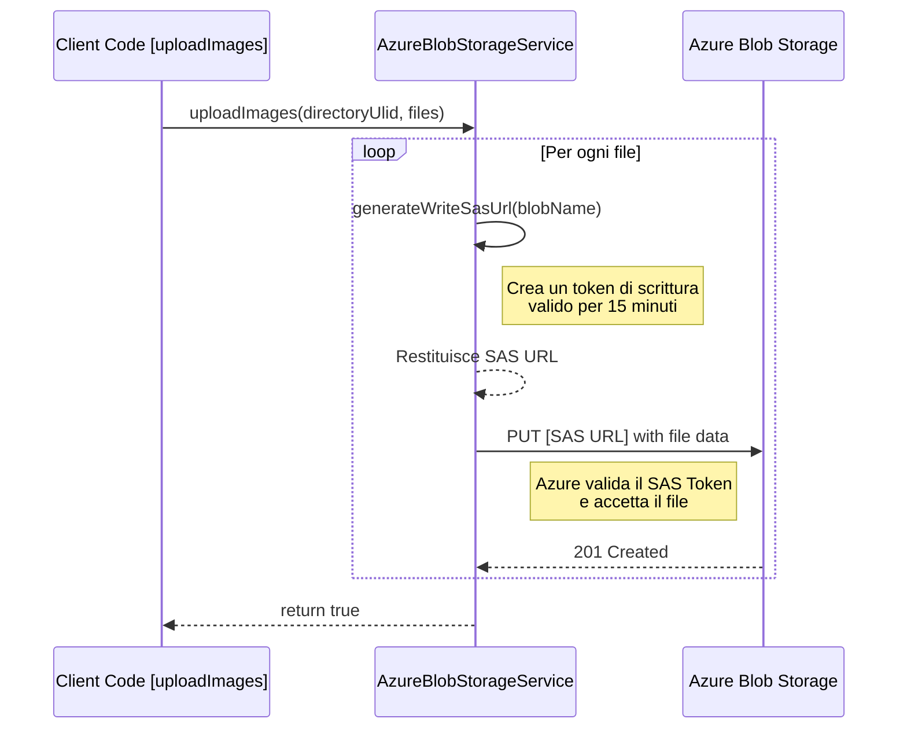

# Piano di Implementazione: Upload su Azure con SAS Token

Questo documento descrive le modifiche necessarie per refattorizzare `AzureBlobStorageService` e implementare un meccanismo di upload sicuro tramite Shared Access Signature (SAS) Token, in linea con lo scenario di un container pubblico in lettura ma protetto in scrittura.

## Strategia Architetturale

L'approccio attuale, che usa `BlobClient.upload()`, si basa su una `connection-string` che conferisce pieni poteri, il che è scorretto per il nostro caso d'uso.

La nuova strategia prevede:
1.  Il `BlobServiceClient`, inizializzato con la `connection-string`, viene mantenuto ma usato **esclusivamente** come "autorità" per generare SAS Token di scrittura a tempo.
2.  Il metodo `uploadImages` non carica più i file direttamente. Per ogni file, genera un URL univoco contenente un SAS Token che autorizza una singola operazione di scrittura (`PUT`).
3.  L'upload viene eseguito tramite un client HTTP standard, che effettua una richiesta `PUT` a questo URL temporaneo.

Questo disaccoppia l'autorizzazione (generazione del token) dall'operazione di upload, aumentando la sicurezza.

## Diagramma di Flusso



## Modifiche al Codice (`AzureBlobStorageService.java`)

### 1. Aggiunta di Import Necessari

Sarà necessario aggiungere import per la generazione del SAS e per un client HTTP.

```java
import com.azure.storage.blob.sas.BlobServiceSasSignatureValues;
import com.azure.storage.blob.sas.BlobSasPermission;
import java.time.OffsetDateTime;
import java.net.http.HttpClient;
import java.net.http.HttpRequest;
import java.net.http.HttpResponse;
import java.net.URI;
import com.azure.core.util.Context;
```

### 2. Nuovo Metodo Privato: `generateWriteSasUrl`

Questo metodo si occuperà di creare l'URL con il token SAS.

```java
private String generateWriteSasUrl(String blobName) {
    BlobClient blobClient = blobContainerClient.getBlobClient(blobName);

    // Imposta i permessi (solo scrittura e creazione) e la scadenza (es. 15 minuti)
    BlobSasPermission sasPermission = new BlobSasPermission().setWritePermission(true).setCreatePermission(true);
    OffsetDateTime expiryTime = OffsetDateTime.now().plusMinutes(15);

    // Crea i valori della firma SAS
    BlobServiceSasSignatureValues sasSignatureValues = new BlobServiceSasSignatureValues(expiryTime, sasPermission)
            .setProtocol(com.azure.storage.common.sas.SasProtocol.HTTPS_ONLY);

    // Genera il token SAS per il blob specifico
    String sasToken = blobClient.generateSas(sasSignatureValues);

    // Costruisce e restituisce l'URL completo
    return String.format("%s?%s", blobClient.getBlobUrl(), sasToken);
}
```

### 3. Rifattorizzazione del Metodo `uploadImages`

Il metodo verrà riscritto per usare il nuovo approccio.

```java
public boolean uploadImages(String directoryUlid, List<MultipartFile> files) {
    // La validazione delle immagini rimane invariata
    for (MultipartFile file : files) {
        String contentType = Objects.requireNonNullElse(file.getContentType(), "application/octet-stream");
        try {
            imageValidationService.validateImage(file.getInputStream(), contentType, file.getSize());
        } catch (IOException e) {
            throw new IllegalArgumentException("Errore durante la validazione dell'immagine: " + e.getMessage(), e);
        }
    }

    // Nuovo flusso di upload con SAS Token
    HttpClient httpClient = HttpClient.newHttpClient();

    for (MultipartFile file : files) {
        String blobName = directoryUlid + "/" + file.getOriginalFilename();
        String sasUrl = generateWriteSasUrl(blobName);

        try {
            HttpRequest request = HttpRequest.newBuilder()
                    .uri(URI.create(sasUrl))
                    .header("x-ms-blob-type", "BlockBlob")
                    .header("Content-Type", file.getContentType())
                    .PUT(HttpRequest.BodyPublishers.ofInputStream(file::getInputStream))
                    .build();

            HttpResponse<String> response = httpClient.send(request, HttpResponse.BodyHandlers.ofString());

            if (response.statusCode() != 201) { // 201 Created è il codice di successo per un PUT
                throw new RuntimeException("Errore durante l'upload del file: " + file.getOriginalFilename() + ". Status: " + response.statusCode());
            }

        } catch (IOException | InterruptedException e) {
            Thread.currentThread().interrupt();
            throw new RuntimeException("Errore durante l'upload del file: " + file.getOriginalFilename(), e);
        }
    }

    return true;
}
```

## Dipendenze

L'`HttpClient` fa parte del JDK 11+, quindi non sono richieste nuove dipendenze in `pom.xml`.

## Configurazione

Nessuna modifica è richiesta in `application.properties`. La proprietà `azure.storage.connection-string` continuerà ad essere usata dal `BlobServiceClient` per generare i token.