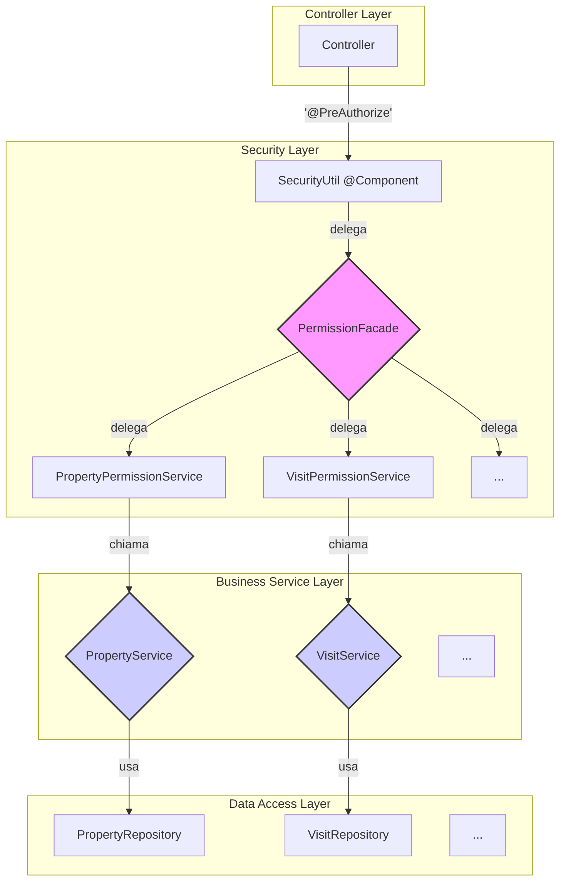

# Progettazione del Sistema di Permessi Centralizzato

Questo documento delinea l'architettura per un nuovo sistema di gestione dei permessi centralizzato, progettato per sostituire la logica di autorizzazione esistente e allinearsi ai principi SOLID e di Clean Architecture.

## 1. Interfaccia della Facade di Permessi (`PermissionFacade`)

La `PermissionFacade` è l'entry-point unico per tutte le verifiche di autorizzazione. Viene iniettata nel nuovo `SecurityUtil` e invocata dalle espressioni `@PreAuthorize` nei controller.

```java
package com.dieti.dietiestatesbackend.security.permissions;

import com.dieti.dietiestatesbackend.dto.request.VisitCreationRequestDTO;
import com.dieti.dietiestatesbackend.enums.VisitStatus;
import com.dieti.dietiestatesbackend.security.AppPrincipal;

/**
 * Facade centrale per la gestione dei permessi.
 * Punto di ingresso unico per tutte le verifiche di autorizzazione basate su logica di business.
 * Sostituisce la logica sparsa in SecurityUtil e disaccoppia i controller dal data layer.
 */
public interface PermissionFacade {

    // #region Property Permissions
    boolean canAccessProperty(AppPrincipal principal, Long propertyId);
    boolean canViewPropertyVisits(AppPrincipal principal, Long propertyId);
    // #endregion

    // #region Agent Permissions
    boolean isAgentOrManager(AppPrincipal principal, Long agentId);
    boolean canViewAgentRelatedEntities(AppPrincipal principal, Long agentId);
    // #endregion

    // #region Agent Availability Permissions
    boolean canManageAgentAvailability(AppPrincipal principal, Long availabilityId);
    // #endregion

    // #region Visit Permissions
    boolean canCreateVisit(AppPrincipal principal, VisitCreationRequestDTO request);
    boolean canUpdateVisitStatus(AppPrincipal principal, Long visitId, VisitStatus newStatus);
    boolean canCancelVisit(AppPrincipal principal, Long visitId);
    // #endregion

    // #region Offer Permissions
    boolean isAgentOfOffer(AppPrincipal principal, Long offerId);
    // #endregion

    // #region Contract Permissions
    boolean canAccessContract(AppPrincipal principal, Long contractId);
    // #endregion
}

## 2. Interfacce dei Sottoservizi di Dominio

La `PermissionFacade` delega le decisioni a sottoservizi specializzati. Ogni sottoservizio è responsabile di un'area di dominio specifica e interagisce con i service di business (es. `PropertyService`, `VisitService`) per recuperare i dati necessari, mai direttamente con i repository.

### 2.1 `PropertyPermissionService`

```java
package com.dieti.dietiestatesbackend.security.permissions;

import com.dieti.dietiestatesbackend.security.AppPrincipal;

public interface PropertyPermissionService {
    boolean canAccessProperty(AppPrincipal principal, Long propertyId);
    boolean canViewPropertyVisits(AppPrincipal principal, Long propertyId);
}
```

### 2.2 `VisitPermissionService`

```java
package com.dieti.dietiestatesbackend.security.permissions;

import com.dieti.dietiestatesbackend.dto.request.VisitCreationRequestDTO;
import com.dieti.dietiestatesbackend.enums.VisitStatus;
import com.dieti.dietiestatesbackend.security.AppPrincipal;

public interface VisitPermissionService {
    boolean canCreateVisit(AppPrincipal principal, VisitCreationRequestDTO request);
    boolean canUpdateVisitStatus(AppPrincipal principal, Long visitId, VisitStatus newStatus);
    boolean canCancelVisit(AppPrincipal principal, Long visitId);
}
```

### 2.3 `AgentPermissionService`

```java
package com.dieti.dietiestatesbackend.security.permissions;

import com.dieti.dietiestatesbackend.security.AppPrincipal;

public interface AgentPermissionService {
    boolean isAgentOrManager(AppPrincipal principal, Long agentId);
    boolean canViewAgentRelatedEntities(AppPrincipal principal, Long agentId);
    boolean canManageAgentAvailability(AppPrincipal principal, Long availabilityId);
}
```

### 2.4 `OfferPermissionService`

```java
package com.dieti.dietiestatesbackend.security.permissions;

import com.dieti.dietiestatesbackend.security.AppPrincipal;

public interface OfferPermissionService {
    boolean isAgentOfOffer(AppPrincipal principal, Long offerId);
}
```

### 2.5 `ContractPermissionService`

```java
package com.dieti.dietiestatesbackend.security.permissions;

import com.dieti.dietiestatesbackend.security.AppPrincipal;

public interface ContractPermissionService {
    boolean canAccessContract(AppPrincipal principal, Long contractId);
}
```

## 3. Implementazione della Facade e dei Sottoservizi

### 3.1 `PermissionFacadeImpl`

Questa classe implementa `PermissionFacade` e agisce come un orchestratore, iniettando tutti i sottoservizi di permesso e delegando a loro le chiamate.

```java
package com.dieti.dietiestatesbackend.security.permissions;

import org.springframework.stereotype.Component;
import lombok.RequiredArgsConstructor;

@Component
@RequiredArgsConstructor
public class PermissionFacadeImpl implements PermissionFacade {

    private final PropertyPermissionService propertyPermissionService;
    private final VisitPermissionService visitPermissionService;
    private final AgentPermissionService agentPermissionService;
    private final OfferPermissionService offerPermissionService;
    private final ContractPermissionService contractPermissionService;

    @Override
    public boolean canAccessProperty(AppPrincipal principal, Long propertyId) {
        return propertyPermissionService.canAccessProperty(principal, propertyId);
    }

    @Override
    public boolean canViewPropertyVisits(AppPrincipal principal, Long propertyId) {
        return propertyPermissionService.canViewPropertyVisits(principal, propertyId);
    }

    // ... implementazioni degli altri metodi che delegano ai rispettivi service ...
}
```

### 3.2 Esempio di Sottoservizio: `PropertyPermissionServiceImpl`

Questa implementazione mostra come un sottoservizio interagisce con il service layer di business (`PropertyService`) per prendere decisioni, senza mai toccare un repository.

```java
package com.dieti.dietiestatesbackend.security.permissions;

import com.dieti.dietiestatesbackend.entities.Property;
import com.dieti.dietiestatesbackend.security.AppPrincipal;
import com.dieti.dietiestatesbackend.service.PropertyService;
import org.springframework.stereotype.Component;
import lombok.RequiredArgsConstructor;

@Component
@RequiredArgsConstructor
public class PropertyPermissionServiceImpl implements PropertyPermissionService {

    private final PropertyService propertyService; // Inietta il service, non il repository

    @Override
    public boolean canAccessProperty(AppPrincipal principal, Long propertyId) {
        if (isManager(principal)) return true;

        try {
            Property property = propertyService.getProperty(propertyId);
            return principal.getId().equals(property.getAgent().getId());
        } catch (Exception e) {
            // Se la proprietà non esiste o c'è un errore, l'accesso è negato
            return false;
        }
    }

    @Override
    public boolean canViewPropertyVisits(AppPrincipal principal, Long propertyId) {
        // Logica identica a canAccessProperty per questo caso d'uso
        return canAccessProperty(principal, propertyId);
    }
    
    private boolean isManager(AppPrincipal principal) {
        return principal != null && principal.isManager();
    }
}
```

## 4. Piano di Refactoring per `SecurityUtil`

`SecurityUtil` verrà trasformato da un gestore di logica di business a un semplice bean di utilità per Spring Expression Language (SpEL). Il suo ruolo sarà limitato a fare da ponte tra il contesto di sicurezza di Spring e la nostra `PermissionFacade`.

**Modifiche chiave:**

1.  **Rimozione delle dipendenze dai Repository**: Tutte le iniezioni di `PropertyRepository`, `VisitRepository`, e `AgentAvailabilityRepository` verranno rimosse.
2.  **Iniezione della `PermissionFacade`**: Verrà iniettata la nuova `PermissionFacade`.
3.  **Delega completa**: Ogni metodo in `SecurityUtil` (es. `canAccessProperty`) non conterrà più logica, ma delegherà direttamente la chiamata al metodo corrispondente della `PermissionFacade`.

Ecco come apparirà la classe `SecurityUtil` dopo il refactoring:

```java
package com.dieti.dietiestatesbackend.security;

import org.springframework.stereotype.Component;
import lombok.RequiredArgsConstructor;
import com.dieti.dietiestatesbackend.dto.request.VisitCreationRequestDTO;
import com.dieti.dietiestatesbackend.enums.VisitStatus;
import com.dieti.dietiestatesbackend.security.permissions.PermissionFacade;

/**
 * Utility bean esposto per SpEL nelle espressioni @PreAuthorize.
 * Delega tutte le decisioni di business alla PermissionFacade.
 * Il suo unico scopo è fare da ponte tra il contesto di sicurezza e il sistema di permessi.
 */
@Component("securityUtil")
@RequiredArgsConstructor
public class SecurityUtil {

    private final PermissionFacade permissionFacade;

    public boolean canAccessProperty(AppPrincipal principal, Long propertyId) {
        return permissionFacade.canAccessProperty(principal, propertyId);
    }

    public boolean canViewPropertyVisits(AppPrincipal principal, Long propertyId) {
        return permissionFacade.canViewPropertyVisits(principal, propertyId);
    }

    public boolean isAgentOrManager(AppPrincipal principal, Long agentId) {
        return permissionFacade.isAgentOrManager(principal, agentId);
    }

    public boolean canCreateVisit(AppPrincipal principal, VisitCreationRequestDTO request) {
        return permissionFacade.canCreateVisit(principal, request);
    }

    public boolean canUpdateVisitStatus(AppPrincipal principal, Long visitId, VisitStatus newStatus) {
        return permissionFacade.canUpdateVisitStatus(principal, visitId, newStatus);
    }

    public boolean canCancelVisit(AppPrincipal principal, Long visitId) {
        return permissionFacade.canCancelVisit(principal, visitId);
    }
    
    // ... e così via per tutti gli altri metodi ...
}
```

## 5. Aggiornamento delle Chiamate `@PreAuthorize`

**Nessuna modifica richiesta.**

Grazie al design adottato, dove il nuovo `SecurityUtil` mantiene la stessa firma dei metodi del precedente, le espressioni `@PreAuthorize` esistenti nei controller continueranno a funzionare senza alcuna modifica.

Ad esempio, in `VisitController`:
```java
@DeleteMapping("/visits/{visitId}")
@PreAuthorize("@securityUtil.canCancelVisit(authentication.principal, #visitId)")
public ResponseEntity<AgentVisitDTO> cancelVisit(...) { ... }
```
La chiamata a `@securityUtil.canCancelVisit` rimarrà invariata, ma la sua implementazione interna ora seguirà il flusso di delega definito in questa architettura, garantendo un refactoring trasparente per il layer dei controller.

## 6. Diagramma Architetturale

Il seguente diagramma Mermaid illustra il flusso di una richiesta di autorizzazione attraverso la nuova architettura.

