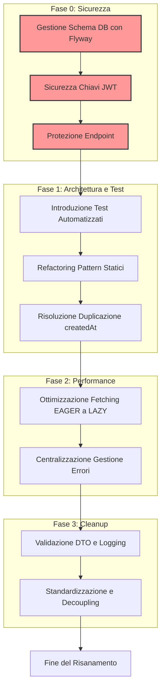

# Piano di Risanamento e Refactoring: DietiEstatesBackend

Questo documento delinea un piano strategico per risolvere le problematiche identificate nella codebase del progetto, con l'obiettivo di allinearlo ai principi di **CLEAN CODE** e **SOLID**, garantendo **sicurezza**, **manutenibilità** e **performance**.

## Principi Guida

Ogni azione proposta sarà guidata dai seguenti principi:

*   **Single Responsibility Principle (SRP):** Ogni classe o metodo deve avere una sola, ben definita, responsabilità.
*   **Dependency Inversion Principle (DIP):** Le classi di alto livello non devono dipendere da quelle di basso livello. Entrambe devono dipendere da astrazioni. Utilizzeremo massicciamente la **Dependency Injection (DI)**.
*   **Don't Repeat Yourself (DRY):** Evitare la duplicazione del codice centralizzando la logica comune.
*   **Readability & Maintainability:** Il codice deve essere facile da leggere, capire e modificare.
*   **Secure by Design:** La sicurezza deve essere un requisito fondamentale, non un'aggiunta successiva.
*   **Performance Awareness:** Evitare pattern noti per causare problemi di performance (es. N+1 query) e ottimizzare dove necessario.

---
## Stato di Avanzamento del Refactoring

A seguito delle nuove problematiche emerse e della richiesta di posticipare alcuni task, di seguito è riportata una tabella riepilogativa dello stato di avanzamento.

| Fase | Punto | Problematica/Task | Stato | Note |
| :--- | :--- | :--- | :--- | :--- |
| **Fase 0: Sicurezza** | 1. | Gestione Schema Database Sicura | Completato | - |
| | 2. | Vulnerabilità Gestione Segreti JWT | Completato | - |
| | 3. | Protezione Endpoint Utente | Completato | - |
| **Fase 1: Architettura e Test** | 1. | Introduzione Framework di Test | In Sospeso | Rimandato su richiesta utente |
| | 2. | Eliminazione Pattern Statici (Anti-IoC) | Completato | - |
| | 3. | Risoluzione Duplicazione `createdAt` | Completato | - |
| **Fase 2: Performance** | 1. | Gestione Fetching EAGER | Da Avviare | - |
| | 2. | Centralizzazione Gestione Errori | Da Avviare | - |
| **Fase 3: Cleanup** | - | Cleanup e Best Practices | Da Avviare | Include validazione DTO, logging, etc. |

## Fasi di Lavoro

Il piano è suddiviso in fasi prioritarie, dalla risoluzione delle criticità più urgenti al cleanup generale.

### Fase 0: Messa in Sicurezza e Stabilizzazione (Priorità Massima)

Questa fase affronta le vulnerabilità critiche che espongono il sistema a rischi di sicurezza e perdita di dati.

**1. Gestione Schema Database Sicura**
*   **Problema:** `spring.jpa.hibernate.ddl-auto=update` è una pratica rischiosa che può portare a corruzione dello schema in produzione.
*   **Azione Correttiva:**
    1.  Disattivare `ddl-auto` impostandolo a `validate` o `none` in produzione (`application-prod.properties`).
    2.  Abilitare e configurare **Flyway** (`spring.flyway.enabled=true`).
    3.  Creare uno script di migrazione Flyway iniziale (`V1__init_schema.sql`) che rifletta lo stato attuale del database. Tutte le modifiche future allo schema dovranno essere gestite tramite nuovi script di migrazione.
*   **Principi Applicati:**
    *   **Manutenibilità:** Versionamento e gestione controllata delle modifiche al database.
    *   **Sicurezza:** Prevenzione della corruzione e perdita di dati.

**2. Vulnerabilità nella Gestione dei Segreti JWT**
*   **Problema:** Chiave segreta hardcoded e possibilità di avvio con chiave vuota.
*   **Azione Correttiva:**
    1.  Rimuovere la chiave segreta hardcoded e il fallback da `AccessTokenProvider.java`.
    2.  Centralizzare la configurazione della chiave in `application.properties` (es. `jwt.secret.access-token`).
    3.  Iniettare la chiave tramite `@Value("${jwt.secret.access-token}")` nel costruttore di `AccessTokenProvider`.
    4.  Aggiungere un controllo all'avvio dell'applicazione (es. un `@PostConstruct` o un `ApplicationRunner`) che verifichi la presenza e la validità della chiave, sollevando un'eccezione in caso di configurazione mancante o debole (es. lunghezza minima).
*   **Principi Applicati:**
    *   **Secure by Design:** Eliminazione di segreti hardcoded e applicazione del principio "fail-fast".
    *   **DIP:** La classe dipende da una configurazione iniettata, non da valori interni.

**3. Protezione Endpoint Utente**
*   **Problema:** L'endpoint `/agent/info/{id}` in `UserController.java` è privo di controlli di autorizzazione.
*   **Azione Correttiva:**
    1.  Applicare un'annotazione di sicurezza, ad esempio `@PreAuthorize("hasRole('ADMIN') or #id == authentication.principal.id")`. Questo permette a un admin di vedere qualsiasi profilo o a un utente di vedere solo il proprio.
    2.  Valutare se l'endpoint debba essere accessibile solo a ruoli specifici (es. `AGENTI` e `ADMIN`).
*   **Principi Applicati:**
    *   **Secure by Design:** Applicazione del principio del "least privilege".

---

### Fase 1: Refactoring Strutturale e Introduzione Test (Priorità Alta)

Questa fase mira a migliorare l'architettura, eliminare gli anti-pattern e creare una base solida per i test automatizzati.

**1. Introduzione di un Framework di Test Completo**
*   **Problema:** Assenza totale di test automatizzati.
*   **Azione Correttiva:**
    1.  Configurare **JUnit 5**, **Mockito** e **Testcontainers** nel `pom.xml` per test di unità e di integrazione.
    2.  **Scrivere Test di Integrazione** per i flussi critici:
        *   Autenticazione (registrazione, login, refresh token).
        *   Creazione di una proprietà.
    3.  **Scrivere Test Unitari** per le classi di servizio e i componenti critici man mano che vengono refattorizzati (vedi punti successivi).
*   **Principi Applicati:**
    *   **Manutenibilità:** I test garantiscono che il refactoring non introduca regressioni.
    *   **Qualità del Codice:** I test fungono da documentazione vivente e migliorano il design.

**2. Eliminazione di Pattern Statici (Anti-IoC)**
*   **Problema:** L'uso di metodi e campi statici in `RefreshTokenProvider`, `PropertyImageUtils` e `UserService` viola i principi di IoC/DI, rendendo il codice difficile da testare e manutenere.
*   **Azione Correttiva:**
    1.  Trasformare le classi con metodi statici in **bean Spring** (es. con `@Service` o `@Component`).
    2.  Rimuovere la keyword `static` da metodi e campi.
    3.  Iniettare queste classi come dipendenze nei controller e nei servizi che le utilizzano, usando l'iniezione tramite costruttore.
    4.  **Caso specifico `UserService.java`:** L'istanza statica di `BCryptPasswordEncoder` deve essere sostituita da un `Bean` definito in `SecurityConfig` e iniettato nel servizio.
*   **Principi Applicati:**
    *   **DIP:** Inversione del controllo; le classi ricevono le loro dipendenze invece di crearle.
    *   **Testabilità:** Le dipendenze possono essere facilmente mockate nei test unitari.

**3. Risoluzione Duplicazione e Incoerenza in `createdAt`**
*   **Problema:** Campo `createdAt` duplicato e in conflitto tra `BaseEntity` e `Property`.
*   **Azione Correttiva:**
    1.  Rimuovere il campo `createdAt` dalla classe `Property.java`.
    2.  Fare affidamento esclusivamente sul campo ereditato da `BaseEntity.java`, che viene gestito da **JPA Auditing** (`@CreatedDate`).
    3.  Rimuovere la logica manuale di impostazione di `createdAt` dallo script di migrazione e dal codice Java.
*   **Principi Applicati:**
    *   **DRY:** Eliminazione della duplicazione del campo.
    *   **SRP:** La responsabilità della gestione dei campi di audit è delegata a JPA, non alla logica applicativa.

---

### Fase 2: Ottimizzazione delle Performance (Priorità Media)

Questa fase si concentra sulla risoluzione dei potenziali colli di bottiglia.

**1. Gestione del Fetching EAGER**
*   **Problema:** L'uso diffuso di `FetchType.EAGER` può causare problemi di performance (N+1 query).
*   **Azione Correttiva:**
    1.  Modificare tutte le relazioni `@ManyToOne` e `@OneToOne` impostando `fetch = FetchType.LAZY`.
    2.  Analizzare le query esistenti e, dove necessario, utilizzare **`JOIN FETCH`** nelle query JPQL o `EntityGraph` per caricare esplicitamente le relazioni richieste in una singola query, solo quando servono.
    3.  **Caso specifico `ResidentialPropertyCreator.java`:** La query per `Heating` può essere ottimizzata per evitare N+1.
*   **Principi Applicati:**
    *   **Performance Awareness:** Caricamento pigro dei dati come default per evitare overhead non necessario.
    *   **Manutenibilità:** Le strategie di fetching esplicite rendono più chiaro il comportamento delle query.

**2. Centralizzazione della Gestione Errori**
*   **Problema:** Gestione delle eccezioni localizzata e inconsistente, come in `PropertiesController.java`.
*   **Azione Correttiva:**
    1.  Rimuovere i blocchi `try-catch` specifici per `MethodArgumentNotValidException` dai controller.
    2.  Sfruttare e potenziare il `GlobalExceptionHandler.java` per gestire centralmente tutte le eccezioni di validazione e le altre eccezioni comuni (`EntityNotFoundException`, etc.).
    3.  Standardizzare i formati di risposta per gli errori.
*   **Principi Applicati:**
    *   **DRY:** La logica di gestione degli errori è in un unico posto.
    *   **SRP:** I controller sono responsabili della logica di business, non della formattazione delle risposte di errore.

---

### Fase 3: Code Cleanup e Adozione Best Practices (Priorità Bassa)

Questa fase si occupa delle criticità minori e del miglioramento generale della qualità del codice.

*   **Validazione DTO:** Aggiungere annotazioni di validazione (es. `@NotBlank`, `@Email`) ai campi di `AuthRequest.java` e altri DTO che ne sono privi.
*   **Logging:** Ridurre il logging a livello `INFO` per operazioni di routine e usare `DEBUG` per informazioni dettagliate, rimuovendo il logging eccessivamente verboso.
*   **Codici di Stato HTTP:** Sostituire codici non standard (es. `498`) con alternative standard (es. `401 Unauthorized` o `403 Forbidden`).
*   **Decoupling `User` e `UserDetails`:** Creare una classe `AppPrincipal` che implementa `UserDetails` e contiene un'istanza di `User`. Il `CustomUserDetailsService` costruirà e restituirà `AppPrincipal` invece dell'entità `User` direttamente. Questo disaccoppia il modello di dominio dal modello di sicurezza.
*   **Refactoring `PropertyMapper`:** Trasformare i metodi statici in metodi di istanza e iniettare il mapper dove necessario. Se il mapper è stateless, può rimanere un `@Component`.
*   **Metadati `pom.xml`:** Completare le informazioni del progetto (descrizione, sviluppatori, licenza).
*   **Spiegare `@SuppressWarnings`:** Aggiungere un commento che spieghi perché la soppressione dell'avviso è sicura in `PropertyService.java`.
*   **Visibilità `LogoutResult`:** Valutare se il record `LogoutResult` in `AuthService.java` possa essere reso un record privato o una classe interna se usato solo da `AuthService`.

---

## Diagramma di Flusso del Piano (Mermaid)

Questo piano, se eseguito in ordine, trasformerà la codebase in un'applicazione più sicura, robusta e pronta per future evoluzioni.