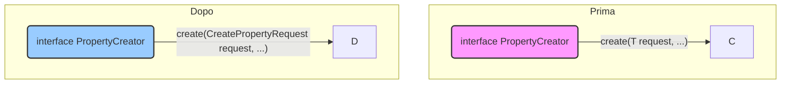
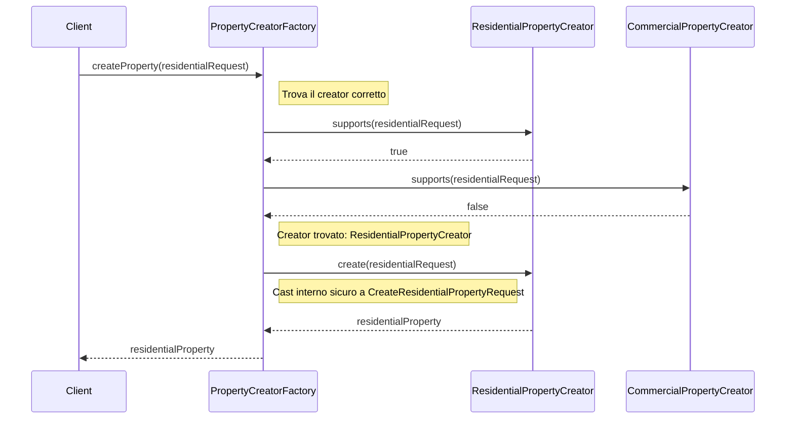

# Piano di Refactoring per PropertyCreator e PropertyCreatorFactory

**Obiettivo:** Eliminare l'uso di `SuppressWarnings("unchecked")` e `instanceof` nel processo di creazione delle proprietà, migliorando la type safety, la leggibilità e la manutenibilità del codice, pur mantenendo i vantaggi del pattern Factory/Strategy.

---

### 1. Modifica dell'interfaccia `PropertyCreator`

L'interfaccia `PropertyCreator` verrà semplificata rimuovendo il parametro generico `<T>`.

**Modifiche:**
-   Rimuovere `<T extends CreatePropertyRequest>` dalla definizione dell'interfaccia.
-   Modificare la firma del metodo `create` per accettare `CreatePropertyRequest` come parametro, invece del tipo generico `T`.

**Diagramma:**

---

### 2. Aggiornamento delle Implementazioni di `PropertyCreator`

Tutte le classi che implementano `PropertyCreator` (es. `ResidentialPropertyCreator`, `CommercialPropertyCreator`, etc.) saranno aggiornate per conformarsi alla nuova interfaccia.

**Modifiche:**
-   Ogni `...PropertyCreator` implementerà la nuova interfaccia non generica.
-   All'interno del metodo `create`, verrà eseguito un cast esplicito e sicuro del `CreatePropertyRequest` al tipo di DTO specifico (es. `CreateResidentialPropertyRequest`).

**Giustificazione della Sicurezza del Cast:**
Il cast è sicuro perché il metodo `supports(CreatePropertyRequest request)` viene invocato prima del metodo `create`. Poiché `supports` controlla il discriminatore `propertyType`, garantisce che l'oggetto `request` sia del tipo corretto atteso dal creator. Questo pre-controllo rende il cast una operazione sicura.

---

### 3. Rifattorizzazione di `PropertyCreatorFactory`

La factory sarà modificata per eliminare la necessità di cast e `SuppressWarnings`.

**Modifiche:**
-   Il costruttore accetterà una `List<PropertyCreator>` (senza wildcard generiche `?`).
-   Il metodo `createProperty` non avrà più bisogno dell'helper `invokeCreate`. Selezionerà il creator corretto tramite `supports` e chiamerà direttamente il metodo `create`, passando la `request` senza cast.
-   Il metodo `invokeCreate` e l'annotazione `@SuppressWarnings("unchecked")` verranno rimossi.

**Flusso di Esecuzione:**

---

### 4. Valutazione dell'Impatto

-   **Type Safety:** **Aumentata**. Il compilatore può eseguire controlli più stringenti. La responsabilità della gestione del tipo è delegata al creator specifico, che ha la conoscenza per farlo in sicurezza.
-   **Leggibilità:** **Migliorata**. Il codice della factory diventa più lineare e facile da comprendere, senza la complessità di helper generici e `SuppressWarnings`.
-   **Manutenibilità:** **Migliorata**. L'aggiunta di un nuovo tipo di proprietà richiederà solo la creazione di una nuova implementazione di `PropertyCreator`, senza alcuna modifica alla logica della factory.
-   **Testabilità:** **Invariata o leggermente migliorata**. I creator possono essere testati unitariamente in modo ancora più semplice e isolato.

---

Questo piano consente di mantenere i benefici del pattern Factory/Strategy (disaccoppiamento, estensibilità) eliminando le debolezze attuali legate alla gestione dei tipi generici in Java.