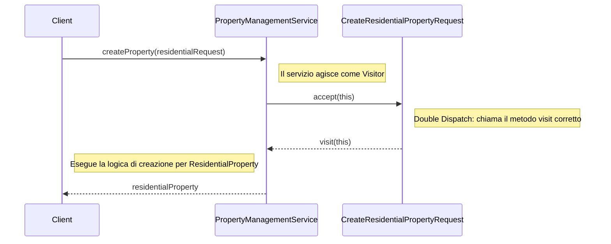

# Piano di Refactoring (Visitor Pattern) per la Creazione di Proprietà

**Obiettivo:** Implementare una soluzione di creazione delle proprietà basata sul pattern Visitor per eliminare completamente cast, `instanceof` e `if/else` basati sul tipo, ottenendo un'architettura polimorfica, robusta e aderente ai principi SOLID.

---

### 1. Abbandono di `PropertyCreator` e `PropertyCreatorFactory`

L'approccio basato su Factory/Strategy verrà dismesso. Questo significa che i seguenti componenti saranno **rimossi**:
-   Interfaccia `PropertyCreator`
-   Tutte le sue implementazioni (`ResidentialPropertyCreator`, `CommercialPropertyCreator`, etc.)
-   La classe `PropertyCreatorFactory`

Questo semplificherà drasticamente la struttura del codice eliminando un intero layer di astrazione che si è rivelato non ottimale.

---

### 2. Implementazione del `PropertyCreationVisitor`

Sfrutteremo l'infrastruttura già presente (`CreatePropertyRequest.accept(...)`).

**Modifiche:**
1.  **Creare/Utilizzare l'interfaccia `PropertyCreationVisitor<T>`:** Questa interfaccia definirà un metodo `visit` per ogni sottoclasse concreta di `CreatePropertyRequest`.
    ```java
    public interface PropertyCreationVisitor<T> {
        T visit(CreateResidentialPropertyRequest request);
        T visit(CreateCommercialPropertyRequest request);
        T visit(CreateLandPropertyRequest request);
        T visit(CreateGaragePropertyRequest request);
    }
    ```
2.  **Implementare il Visitor:** Un servizio, ad esempio `PropertyCreationService` (o lo stesso `PropertyManagementService`), implementerà `PropertyCreationVisitor<Property>`. Ogni metodo `visit` conterrà la logica specifica per creare un tipo di proprietà, che prima risiedeva nei `PropertyCreator`.

**Diagramma di Flusso (Visitor Pattern):**


---

### 3. Modifica del Servizio Principale

Il servizio che orchestra la creazione (es. `PropertyManagementService`) non userà più la factory.

**Modifiche:**
-   Il metodo `createProperty` riceverà il `CreatePropertyRequest`.
-   Invocherà semplicemente `request.accept(this)`. Grazie al *double dispatch*, il metodo `visit` corretto verrà chiamato dinamicamente in base al tipo di runtime della `request`, senza alcun bisogno di controlli di tipo espliciti.

---

### 4. Vantaggi di Questo Nuovo Approccio

-   **Zero Cast e `instanceof`:** La soluzione è puramente polimorfica.
-   **Principio Aperto/Chiuso (SOLID):** Per aggiungere un nuovo tipo di proprietà (es. `IndustrialProperty`):
    1.  Si crea `CreateIndustrialPropertyRequest`.
    2.  Si aggiunge `visit(CreateIndustrialPropertyRequest request)` all'interfaccia `PropertyCreationVisitor` e alla sua implementazione.
    Il codice esistente non viene modificato, ma solo esteso.
-   **Single Responsibility Principle (SOLID):** La logica di creazione è centralizzata in un unico componente (il Visitor), il cui unico scopo è creare proprietà.
-   **Leggibilità e Manutenibilità:** Il flusso di controllo è chiaro e guidato dai tipi, rendendo il codice più facile da seguire e manutenere.

---

Questo piano rappresenta la soluzione più robusta e allineata alle best practice di design. Procedendo in questo modo, non solo risolveremo il problema iniziale, ma eleveremo la qualità dell'architettura del sistema.