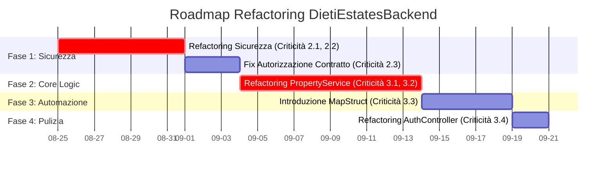

# Piano Strategico e Operativo: Code Review e Ottimizzazione di DietiEstatesBackend

## 1. Sintesi Esecutiva

Il presente documento delinea un piano strategico e operativo per il refactoring e l'ottimizzazione della codebase del progetto DietiEstatesBackend. A seguito di una dettagliata code review, sono emerse criticità significative in aree chiave quali sicurezza, performance e manutenibilità, con deviazioni notevoli dai principi SOLID e di Clean Code.

**Obiettivo Principale:** Risolvere le vulnerabilità architetturali e i code smell identificati per trasformare la codebase in un sistema robusto, scalabile e facilmente manutenibile, in grado di supportare l'evoluzione futura del business.

**Risultati Attesi:**
*   **Miglioramento della Sicurezza:** Eliminazione delle falle di sicurezza e adozione di un modello di autorizzazione estensibile e sicuro.
*   **Incremento delle Performance:** Drastica riduzione della latenza delle richieste API attraverso l'ottimizzazione del processo di autenticazione.
*   **Aumento della Manutenibilità:** Semplificazione della complessità del codice, riduzione del debito tecnico e miglioramento della leggibilità e testabilità.
*   **Aderenza ai Principi Architetturali:** Allineamento della codebase ai principi SOLID e Clean Code per garantire una base solida per futuri sviluppi.

Questo piano fungerà da roadmap per guidare il team di sviluppo attraverso un processo di miglioramento incrementale e misurabile.

## 2. Analisi delle Problematiche Generali

L'analisi della codebase di DietiEstatesBackend ha rivelato un insieme di problematiche interconnesse che minano le fondamenta del sistema. Sebbene l'architettura di partenza sia basata su tecnologie moderne come Spring Boot e JWT, l'implementazione concreta mostra diverse lacune significative. Le criticità possono essere raggruppate in tre macro-aree:

1.  **Debolezze Strutturali nella Sicurezza e Performance:**
    *   **Violazione dei Principi SOLID:** L'infrastruttura di sicurezza, in particolare la classe `SecurityUtil`, viola il principio Open/Closed, creando un'architettura rigida e difficile da estendere.
    *   **Bottleneck di Scalabilità:** Il meccanismo di autenticazione attuale, che interroga il database ad ogni richiesta, rappresenta un grave collo di bottiglia che limita le performance e la capacità di scalare del sistema.
    *   **Logica di Autorizzazione Incompleta:** Le regole di accesso sono codificate in modo incompleto e non riflettono un modello di dominio maturo, introducendo rischi di sicurezza latenti.

2.  **Anti-Pattern e Complessità nel Core Business Logic:**
    *   **"Fat Service" Monolitico:** Il `PropertyService`, cuore della logica di business, soffre dell'anti-pattern "Fat Service". Il metodo `createProperty` è un blocco monolitico di codice che accentra troppe responsabilità, rendendolo estremamente complesso, fragile e difficile da testare.
    *   **Gestione Dati Non Sicura:** L'affidamento a `Map<String, Object>` per la gestione di dati strutturati (i dettagli delle proprietà) bypassa la sicurezza dei tipi di Java, spostando il controllo dal compilatore al runtime e aumentando il rischio di `ClassCastException` e `NullPointerException`.

3.  **Code Smell e Debito Tecnico Diffuso:**
    *   **"Primitive Obsession":** L'uso estensivo di tipi primitivi e il mapping manuale tra DTO ed entità (`PropertyMapper`) generano codice verboso, ripetitivo e prono a errori.
    *   **Violazione del Single Responsibility Principle (SRP):** Responsabilità non pertinenti sono state assegnate a componenti come `AuthController`, rendendo la struttura del codice meno intuitiva e più difficile da navigare.

In sintesi, la codebase soffre di un debito tecnico significativo che, se non indirizzato, frenerà l'innovazione, aumenterà i costi di manutenzione e esporrà il sistema a rischi operativi.

## 3. Principi Architetturali Guida

Tutte le decisioni di refactoring e ottimizzazione saranno guidate dai seguenti principi architetturali, che costituiscono la "stella polare" per la valutazione delle soluzioni proposte. L'obiettivo è bilanciare i requisiti immediati con la visione a lungo termine del sistema.

*   **Sicurezza (Security by Design):** La sicurezza non è un'aggiunta, ma una componente intrinseca del design. Ogni modifica deve essere valutata per il suo impatto sulla postura di sicurezza del sistema, privilegiando meccanismi di autenticazione e autorizzazione robusti, standard e a prova di errore.

*   **Manutenibilità e Aderenza a SOLID/CLEAN CODE:** Il codice deve essere facile da capire, modificare e testare. Questo si ottiene attraverso:
    *   **Single Responsibility Principle (SRP):** Ogni classe e metodo deve avere una sola, ben definita, responsabilità.
    *   **Open/Closed Principle (OCP):** Le entità software devono essere aperte all'estensione, ma chiuse alla modifica.
    *   **Disaccoppiamento (Loose Coupling):** Ridurre le dipendenze dirette tra i componenti tramite l'uso di interfacce e astrazioni.
    *   **Alta Coesione (High Cohesion):** Raggruppare logiche correlate all'interno dello stesso modulo.

*   **Scalabilità e Performance:** L'architettura deve essere in grado di gestire un aumento del carico di lavoro senza un degrado significativo delle performance. Le soluzioni che riducono la latenza, minimizzano le query al database e ottimizzano l'uso delle risorse saranno privilegiate.

*   **Resilienza e Affidabilità:** Il sistema deve essere robusto e tollerante ai guasti. Le soluzioni devono prevenire errori a runtime (es. `NullPointerException`, `ClassCastException`) attraverso la validazione e l'uso di tipi di dati sicuri.

*   **Costo-Efficacia e Pragmatismo:** Ogni soluzione sarà valutata in termini di rapporto costo/beneficio. Si preferiranno soluzioni che offrono il massimo valore con uno sforzo di implementazione ragionevole, evitando l'over-engineering. L'introduzione di nuove dipendenze sarà ponderata attentamente.

## 4. Piano a Fasi (Step-by-Step)

Il piano di refactoring è suddiviso in fasi sequenziali, ciascuna focalizzata su un'area specifica della codebase. Questo approccio incrementale permette di gestire la complessità, misurare i progressi e ridurre i rischi associati a un "big bang refactoring".

---

### **Fase 1: Refactoring della Sicurezza e delle Performance di Autenticazione**

*   **Obiettivo della Fase:** Riprogettare il core dell'infrastruttura di sicurezza per renderlo estensibile, performante e aderente ai principi SOLID, eliminando il bottleneck sul database durante l'autenticazione.
*   **Descrizione delle Attività:**
    1.  Introdurre un'astrazione per il `principal` di sicurezza.
    2.  Modificare la generazione del token JWT per includere i permessi come *claims*.
    3.  Rimuovere le query al database dal filtro di autenticazione.
    4.  Estendere il modello di dominio per supportare una logica di autorizzazione granulare.
*   **Problematiche Specifiche della Fase:**
    *   **2.1. [CRITICA] Violazione Open/Closed Principle in `SecurityUtil`:** L'uso di `instanceof` impedisce l'estensione del modello di sicurezza senza modificare codice esistente e testato.
    *   **2.2. [CRITICA] Bottleneck di Performance nell'Autenticazione:** Ogni richiesta API scatena query ridondanti al database, degradando la latenza e la scalabilità.
    *   **2.3. [MEDIO] Logica di Autorizzazione Incompleta:** Le regole di accesso hard-coded rappresentano una soluzione temporanea e insicura.
*   **Approccio alla Risoluzione:** Si adotterà un approccio basato sull'astrazione e sull'arricchimento dei token. La logica di business verrà spostata dal controllo di tipo a un design polimorfico, mentre le informazioni di autorizzazione verranno "cotte" all'interno del token JWT per un accesso stateless e veloce.

#### **Analisi Dettagliata delle Soluzioni (Fase 1)**

**1. Problematica 2.1: Violazione Open/Closed Principle in `SecurityUtil`**

*   **Pattern Architetturale Rilevante:** **Strategy Pattern** e **Dependency Inversion Principle**. Si introduce un'interfaccia (`AppPrincipal`) che definisce il "contratto" per qualsiasi entità di sicurezza. Le classi concrete (`SecurityUtil`) dipenderanno da questa astrazione, non da implementazioni specifiche.
*   **Soluzione Raccomandata:**
    1.  **Creare l'interfaccia `AppPrincipal`:**
        ```java
        public interface AppPrincipal {
            Long getId();
            String getUsername();
            boolean isManager();
            Collection<? extends GrantedAuthority> getAuthorities();
        }
        ```
    2.  **Modificare l'entità `User`** per implementare `AppPrincipal`.
    3.  **Aggiornare `JwtAuthenticationFilter`** per usare un DTO leggero (es. `AuthenticatedUser`) che implementa `AppPrincipal`, invece dell'intera entità `User`, come `principal` nell'oggetto `Authentication` di Spring Security.
    4.  **Rifattorizzare `SecurityUtil`** per operare esclusivamente sull'interfaccia `AppPrincipal`, eliminando i cast e i controlli `instanceof`.
*   **Vantaggi:**
    *   **Estensibilità:** Il sistema può supportare nuovi tipi di principal (es. per API key, autenticazione a due fattori) senza modificare `SecurityUtil`.
    *   **Disaccoppiamento:** `SecurityUtil` non è più legato all'implementazione dell'entità `User`.
    *   **Testabilità:** È possibile testare `SecurityUtil` con mock di `AppPrincipal` in modo semplice e pulito.
*   **Svantaggi e Compromessi:**
    *   **Complessità Iniziale:** Introduce un livello di astrazione aggiuntivo che richiede una comprensione iniziale. Il beneficio a lungo termine supera di gran lunga questo costo.

**2. Problematica 2.2: Bottleneck di Performance nell'Autenticazione**

*   **Pattern Architetturale Rilevante:** **Stateless Token with Claims**. Il token JWT non è solo un identificatore, ma un contenitore sicuro e auto-consistente di informazioni (claims) che abilita decisioni di autorizzazione senza stato.
*   **Soluzione Raccomandata:**
    1.  **Arricchire il JWT in `AccessTokenProvider`:** Durante la creazione del token, includere come claims l'ID utente, i ruoli e il flag `isManager`.
    2.  **Modificare `JwtAuthenticationFilter`:**
        *   Validare il token JWT.
        *   Estrarre i claims (ID, ruoli, `isManager`).
        *   Costruire un DTO `AuthenticatedUser` (che implementa `AppPrincipal`) con i dati estratti.
        *   Creare l'oggetto `UsernamePasswordAuthenticationToken` usando il DTO `AuthenticatedUser` come principal. **Nessuna query al database viene eseguita in questo flusso.**
*   **Vantaggi:**
    *   **Performance:** Riduzione drastica della latenza per ogni endpoint sicuro (almeno una query al DB eliminata per richiesta).
    *   **Scalabilità:** Il carico sul database viene ridotto significativamente, migliorando la capacità del sistema di gestire un alto numero di utenti concorrenti.
*   **Svantaggi e Compromessi:**
    *   **Stale Data:** I permessi nel token possono diventare obsoleti se i ruoli di un utente cambiano. Questo rischio è mitigato da:
        *   **Token a breve scadenza (short-lived):** Già in uso, forzano un refresh periodico.
        *   **Meccanismo di "logout forzato":** Se necessario, si può implementare una blacklist di token revocati (es. in Redis) per invalidare sessioni compromesse, anche se questo reintroduce uno stato. Per il contesto attuale, i token a breve scadenza sono un compromesso eccellente.
    *   **Dimensione del Token:** Il JWT sarà leggermente più grande, ma l'impatto sulla larghezza di banda è trascurabile nella maggior parte dei casi.

**3. Problematica 2.3: Logica di Autorizzazione Incompleta**

*   **Pattern Architetturale Rilevante:** **Domain-Driven Design (DDD)**. La logica di autorizzazione deve emergere dal modello di dominio, non essere hard-coded nell'infrastruttura.
*   **Soluzione Raccomandata:**
    1.  **Estendere il Modello Dati:** Aggiungere una relazione diretta tra `Contract` e l'utente/agente responsabile (es. un campo `agentId` o `ownerId` nell'entità `Contract`).
    2.  **Aggiornare la Logica di Business:** Modificare `SecurityUtil.canAccessContract` (o un service più appropriato) per verificare che l'ID dell'utente autenticato (`principal.getId()`) corrisponda al proprietario del contratto o che l'utente abbia un ruolo di supervisore (es. `isManager()`).
*   **Vantaggi:**
    *   **Sicurezza Corretta:** La logica di accesso riflette i reali requisiti di business.
    *   **Manutenibilità:** Il codice è più chiaro e allineato al dominio.
*   **Svantaggi e Compromessi:**
    *   **Impatto sul DB:** Richiede una migrazione dello schema del database per aggiungere la nuova colonna.

---

*   **Risultati Attesi e Deliverables (Fase 1):**
    *   Codice sorgente delle classi di sicurezza (`SecurityUtil`, `JwtAuthenticationFilter`, `AccessTokenProvider`) refattorizzato.
    *   Nuova interfaccia `AppPrincipal` e DTO `AuthenticatedUser`.
    *   Script di migrazione del database per l'entità `Contract`.
    *   Test unitari e di integrazione aggiornati che coprono le nuove astrazioni e la logica di autorizzazione.
*   **Metriche di Successo:**
    *   **Latenza Media Richieste Protette:** Riduzione misurabile (target: >50%) della latenza media per gli endpoint che richiedono autenticazione.
    *   **Utilizzo CPU/Connessioni DB:** Riduzione del carico sul database durante i test di carico.
    *   **Code Coverage:** Mantenimento o aumento della copertura dei test per i componenti di sicurezza.
*   **Dipendenze e Prerequisiti:** Nessuna dipendenza esterna critica. La fase può essere eseguita in modo autonomo.

### **Fase 2: Refactoring del Core Business Logic (`PropertyService`)**

*   **Obiettivo della Fase:** Smantellare il metodo monolitico `createProperty` e introdurre un design pulito, type-safe e manutenibile per la creazione e gestione delle proprietà, eliminando i rischi associati alla gestione di dati non tipizzati.
*   **Descrizione delle Attività:**
    1.  Sostituire la `Map<String, Object>` con DTO specifici e polimorfici.
    2.  Introdurre un pattern Factory o Strategy per delegare la creazione delle diverse tipologie di proprietà.
    3.  Decomporre la logica di business in metodi più piccoli e focalizzati.
*   **Problematiche Specifiche della Fase:**
    *   **3.1. [CRITICA] Anti-Pattern "Fat Service" in `PropertyService`:** L'eccessiva complessità del metodo `createProperty` lo rende un incubo per la manutenibilità e una fonte costante di bug.
    *   **3.2. [CRITICA] Gestione Fragile dei Tipi di Proprietà:** L'uso di `switch` e cast manuali da una mappa generica è una pratica estremamente rischiosa che annulla i benefici della tipizzazione statica.
*   **Approccio alla Risoluzione:** La strategia principale è "Divide et Impera". La logica monolitica verrà scomposta in componenti più piccoli e specializzati. L'affidamento a `Map` verrà sostituito da un modello a oggetti robusto e polimorfico, sfruttando le capacità del framework (Jackson) per la de-serializzazione.

#### **Analisi Dettagliata delle Soluzioni (Fase 2)**

**1. Problematica 3.1 & 3.2: "Fat Service" e Gestione Fragile dei Tipi**

*   **Pattern Architetturale Rilevante:** **Factory Pattern** e **DTO Polimorfici**. Il Factory Pattern permette di disaccoppiare il client (il service) dalla creazione concreta degli oggetti. I DTO polimorfici consentono a Jackson di de-serializzare un JSON in oggetti specifici in base a un campo "tipo", eliminando la necessità di logica di parsing manuale.
*   **Soluzione Raccomandata:**
    1.  **Riprogettare i DTO di Richiesta:**
        *   Creare un DTO base `CreatePropertyRequest` con i campi comuni.
        *   Creare DTO specifici che estendono quello base (es. `CreateResidentialPropertyRequest`, `CreateCommercialPropertyRequest`) e contengono i campi specifici per ogni tipo di proprietà.
        *   Usare le annotazioni di Jackson `@JsonTypeInfo` e `@JsonSubTypes` sul DTO base per abilitare la de-serializzazione polimorfica basata su un campo `type` nel JSON in ingresso.
    2.  **Introdurre un `PropertyFactory`:**
        *   Creare un'interfaccia `PropertyCreator` con un metodo `create(CreatePropertyRequest request)`.
        *   Implementare classi concrete per ogni tipo di proprietà (es. `ResidentialPropertyCreator`, `CommercialPropertyCreator`).
        *   Il `PropertyFactory` avrà un metodo `getCreator(PropertyType type)` che restituisce l'implementazione corretta.
    3.  **Rifattorizzare `PropertyService.createProperty`:**
        *   Il metodo ora accetta il `CreatePropertyRequest` polimorfico.
        *   Usa il `PropertyFactory` per ottenere il `PropertyCreator` appropriato.
        *   Delega la creazione della specifica entità `Property` al creator.
        *   La logica di lookup (es. `findAgent`) può essere estratta in metodi privati e riutilizzata.
*   **Vantaggi:**
    *   **Manutenibilità:** Il codice diventa modulare. Aggiungere un nuovo tipo di proprietà richiede di creare una nuova classe `Creator` e un nuovo DTO, senza modificare il service esistente (aderenza all'OCP).
    *   **Affidabilità e Sicurezza dei Tipi:** Il codice è type-safe. Errori di tipo vengono individuati a tempo di compilazione, non a runtime. La validazione dei dati può essere delegata a `javax.validation.constraints` sui DTO.
    *   **Testabilità:** Ogni `Creator` può essere testato in isolamento.
*   **Svantaggi e Compromessi:**
    *   **Aumento del Numero di Classi:** Il design è più verboso in termini di numero di file, ma ogni file è più semplice e focalizzato. Questo è un trade-off positivo per la manutenibilità.

---

*   **Risultati Attesi e Deliverables (Fase 2):**
    *   Nuova gerarchia di DTO polimorfici per la creazione delle proprietà.
    *   Implementazione del `PropertyFactory` e delle strategie `PropertyCreator`.
    *   `PropertyService.createProperty` completamente refattorizzato e semplificato.
    *   Test unitari per ogni `PropertyCreator` e test di integrazione per il flusso di creazione.
*   **Metriche di Successo:**
    *   **Complessità Ciclomatica:** Riduzione drastica della complessità del metodo `createProperty`.
    *   **Linee di Codice (LOC) in `PropertyService`:** Diminuzione significativa delle linee di codice nel metodo principale.
    *   **Eliminazione di `instanceof`/`switch`:** Rimozione completa della logica di `switch` basata sul tipo di proprietà.
*   **Dipendenze e Prerequisiti:** Questa fase è logicamente successiva alla Fase 1, ma può essere sviluppata in parallelo se necessario, poiché tocca un'area diversa della codebase.

### **Fase 3: Automazione del Mapping con MapStruct**

*   **Obiettivo della Fase:** Eliminare il codice di mapping manuale, verboso e prono a errori, introducendo MapStruct per automatizzare la conversione tra DTO ed entità in modo efficiente e type-safe.
*   **Descrizione delle Attività:**
    1.  Aggiungere le dipendenze di MapStruct al `pom.xml`.
    2.  Creare interfacce di mapping annotate per le conversioni principali (es. `PropertyMapper`, `UserMapper`).
    3.  Sostituire le implementazioni manuali con le interfacce generate da MapStruct.
*   **Problematiche Specifiche della Fase:**
    *   **3.3. [MEDIO] Code Smell "Primitive Obsession" e Mapping Manuale:** Il codice di mapping attuale è un classico esempio di boilerplate che aumenta i costi di manutenzione. Ogni modifica a un DTO o a un'entità richiede aggiornamenti manuali e noiosi.
*   **Approccio alla Risoluzione:** Si sfrutterà la generazione di codice in fase di compilazione. Definendo semplicemente delle interfacce, MapStruct analizzerà i getter e i setter delle classi sorgente e destinazione e genererà il codice di mapping ottimizzato, riducendo il codice scritto a mano quasi a zero.

#### **Analisi Dettagliata delle Soluzioni (Fase 3)**

**1. Problematica 3.3: Mapping Manuale**

*   **Pattern Architetturale Rilevante:** **Convenzione sulla Configurazione (Convention over Configuration)**. MapStruct opera seguendo convenzioni intelligenti (es. associa campi con lo stesso nome), riducendo la necessità di configurazione esplicita.
*   **Soluzione Raccomandata:**
    1.  **Aggiungere Dipendenze a `pom.xml`:**
        ```xml
        <dependency>
            <groupId>org.mapstruct</groupId>
            <artifactId>mapstruct</artifactId>
            <version>1.5.5.Final</version> <!-- Usare l'ultima versione stabile -->
        </dependency>
        <dependency>
            <groupId>org.mapstruct</groupId>
            <artifactId>mapstruct-processor</artifactId>
            <version>1.5.5.Final</version>
            <scope>provided</scope>
        </dependency>
        ```
    2.  **Creare Interfacce Mapper:**
        ```java
        @Mapper(componentModel = "spring") // Per l'integrazione con Spring DI
        public interface PropertyMapper {
            PropertyMapper INSTANCE = Mappers.getMapper(PropertyMapper.class);

            PropertyResponse toPropertyResponse(Property property);
            
            // MapStruct gestisce automaticamente i campi con lo stesso nome
            // Si possono aggiungere annotazioni @Mapping per gestire nomi diversi o logiche complesse
        }
        ```
    3.  **Integrazione nel Service:** Iniettare e utilizzare il mapper generato.
        ```java
        @Service
        public class SomeService {
            private final PropertyMapper propertyMapper;

            @Autowired
            public SomeService(PropertyMapper propertyMapper) {
                this.propertyMapper = propertyMapper;
            }

            public PropertyResponse getProperty(Long id) {
                Property property = propertyRepository.findById(id).orElseThrow(...);
                return propertyMapper.toPropertyResponse(property);
            }
        }
        ```
*   **Vantaggi:**
    *   **Riduzione del Boilerplate:** Drastica diminuzione del codice manuale.
    *   **Performance:** Il codice generato è tipicamente più performante del mapping manuale basato sulla reflection.
    *   **Type Safety:** I problemi di mapping vengono rilevati a tempo di compilazione.
    *   **Manutenibilità:** La logica di mapping è centralizzata e dichiarativa.
*   **Svantaggi e Compromessi:**
    *   **Nuova Dipendenza:** Aggiunge una dipendenza al progetto e una fase di pre-processing alla build. Il beneficio in termini di pulizia del codice giustifica ampiamente questo costo.
    *   **Curva di Apprendimento:** Richiede una minima conoscenza delle annotazioni di MapStruct per gestire casi di mapping complessi.

---

*   **Risultati Attesi e Deliverables (Fase 3):**
    *   `pom.xml` aggiornato con le dipendenze di MapStruct.
    *   Interfacce `Mapper` per tutte le principali conversioni DTO/Entità.
    *   Codice dei service e dei controller aggiornato per utilizzare i mapper generati.
    *   Rimozione delle vecchie classi di mapping manuale.
*   **Metriche di Successo:**
    *   **LOC nel package `mappers`:** Riduzione drastica delle linee di codice scritte a mano.
    *   **Build Stabile:** Il processo di build integra correttamente la generazione di codice di MapStruct.
*   **Dipendenze e Prerequisiti:** Può essere eseguita in parallelo alle altre fasi, ma idealmente dopo la Fase 2 per lavorare sui nuovi DTO polimorfici.

### **Fase 4: Fix Minori e Pulizia Generale**

*   **Obiettivo della Fase:** Risolvere le criticità rimanenti a priorità più bassa per migliorare la coerenza e l'organizzazione generale della codebase, completando il processo di allineamento ai principi di Clean Code.
*   **Descrizione delle Attività:**
    1.  Riorganizzare gli endpoint dei controller secondo una logica di dominio.
*   **Problematiche Specifiche della Fase:**
    *   **3.4. [BASSO] Violazione Single Responsibility Principle in `AuthController`:** La presenza di endpoint non legati all'autenticazione (es. `getAgentInfo`) in `AuthController` rende l'API meno intuitiva.
*   **Approccio alla Risoluzione:** Si tratta di un refactoring strutturale semplice che consiste nello spostare metodi tra classi per raggruppare le responsabilità in modo più logico e coerente con un'architettura RESTful ben definita.

#### **Analisi Dettagliata delle Soluzioni (Fase 4)**

**1. Problematica 3.4: Violazione SRP in `AuthController`**

*   **Pattern Architetturale Rilevante:** **Separazione delle Responsabilità (Separation of Concerns)**. I controller in un'applicazione Spring dovrebbero essere organizzati per risorsa di dominio (es. `UserController`, `PropertyController`), non per funzionalità trasversale come l'autenticazione.
*   **Soluzione Raccomandata:**
    1.  **Creare un `UserController` o `AgentController`:** Se non esiste già, creare un nuovo controller dedicato alla gestione delle risorse utente/agente.
    2.  **Spostare l'Endpoint:** Muovere il metodo `getAgentInfo` da `AuthController` al nuovo controller.
    3.  **Aggiornare la Configurazione di Sicurezza:** Assicurarsi che le regole di sicurezza per il nuovo percorso (`/api/users/{id}` o `/api/agents/{id}`) siano configurate correttamente in `SecurityConfig`.
*   **Vantaggi:**
    *   **Coerenza Architetturale:** La struttura dei controller segue le best practice REST, rendendo l'API più facile da comprendere e utilizzare.
    *   **Manutenibilità:** Semplifica la ricerca di endpoint specifici.
*   **Svantaggi e Compromessi:**
    *   **Breaking Change per i Client:** Questo è un breaking change per qualsiasi client dell'API. La modifica deve essere comunicata e coordinata con il team frontend. Si può gestire una transizione mantenendo temporaneamente il vecchio endpoint con un log di deprecazione.

---

*   **Risultati Attesi e Deliverables (Fase 4):**
    *   Nuova classe `UserController` o `AgentController`.
    *   `AuthController` contenente solo endpoint strettamente legati all'autenticazione (login, refresh, signup).
    *   Documentazione API (se presente) aggiornata per riflettere i nuovi percorsi.
*   **Metriche di Successo:**
    *   **Struttura dei Controller:** I controller sono organizzati per risorsa di dominio.
    *   **API Coerente:** L'API segue un design RESTful più pulito.
*   **Dipendenze e Prerequisiti:** Nessuna. Questa fase è indipendente e può essere eseguita in qualsiasi momento, anche se è logicamente l'ultima del ciclo di refactoring.

## 5. Considerazioni su Rischi e Mitigazioni

L'implementazione di un piano di refactoring comporta inevitabilmente dei rischi. Un'analisi proattiva e una pianificazione attenta sono fondamentali per mitigarli.

| Rischio | Probabilità | Impatto | Strategia di Mitigazione |
| :--- | :--- | :--- | :--- |
| **Regressione Funzionale** | Media | Alto | **Copertura Test Completa:** Prima di ogni refactoring, assicurarsi che l'area interessata sia coperta da test di unità e integrazione robusti. Eseguire l'intera suite di test dopo ogni modifica significativa. |
| **Breaking Changes per i Client API** | Alta | Medio | **Versionamento e Comunicazione:** Il refactoring dei controller (Fase 4) è un breaking change. Introdurre il versionamento dell'API (es. `/api/v2/...`) o mantenere gli endpoint deprecati per un periodo di transizione. Comunicare chiaramente le modifiche al team frontend. |
| **Complessità Nascosta** | Media | Medio | **Refactoring Incrementale:** L'approccio a fasi è progettato per gestire la complessità. Se una fase si rivela più complessa del previsto, suddividerla ulteriormente in sotto-task più piccoli e gestibili. |
| **Stale Data nei Token JWT** | Bassa | Medio | **Token a Breve Scadenza:** Mitigato dalla strategia di usare token con scadenza breve (5-15 minuti) e un meccanismo di refresh efficiente. Per scenari ad alta sicurezza, si può valutare una blacklist di token in un secondo momento. |
| **Resistenza al Cambiamento/Curva di Apprendimento** | Bassa | Basso | **Formazione e Pair Programming:** L'introduzione di nuovi strumenti come MapStruct richiede formazione. Organizzare brevi sessioni di formazione e incoraggiare il pair programming per diffondere la conoscenza rapidamente nel team. |
| **Impatto sulle Tempistiche di Sviluppo di Nuove Funzionalità** | Alta | Medio | **Allocazione Dedicata delle Risorse:** Assegnare una quota di tempo di sviluppo (es. 20% dello sprint) specificamente al pagamento del debito tecnico. Questo evita che il refactoring venga costantemente posticipato a favore di nuove feature. |

## 6. Roadmap e Tempistiche (Indicative)

La seguente roadmap fornisce una stima di massima per l'implementazione del piano. Le tempistiche sono indicative e andranno validate e dettagliate dal team di sviluppo. Si assume un team di 2-3 sviluppatori che lavora in sprint di 2 settimane.



| Fase | Attività Principale | Stima Durata | Priorità |
| :--- | :--- | :--- | :--- |
| **Fase 1** | Refactoring Sicurezza e Autenticazione | 2 settimane | **Alta** |
| **Fase 2** | Refactoring `PropertyService` | 2-3 settimane | **Alta** |
| **Fase 3** | Introduzione di MapStruct | 1 settimana | **Media** |
| **Fase 4** | Fix Minori (Controller Refactoring) | 2-3 giorni | **Bassa** |

**Durata Totale Stimata:** 5-7 settimane.

## 7. Conclusioni e Prossimi Passi

Questo piano strategico fornisce una roadmap chiara e attuabile per trasformare la codebase di DietiEstatesBackend da un sistema con un debito tecnico significativo a un asset software robusto, performante e manutenibile. L'esecuzione di questo piano non è solo un esercizio di pulizia del codice, ma un investimento strategico che abiliterà una maggiore velocità di sviluppo, una migliore stabilità e una sicurezza rafforzata per il futuro.

**Raccomandazioni Chiave:**
1.  **Prioritizzare la Sicurezza e le Performance (Fase 1):** I problemi identificati nel meccanismo di autenticazione sono i più critici e devono essere affrontati con la massima priorità.
2.  **Adottare un Approccio Disciplinato al Refactoring:** Seguire le fasi in modo sequenziale, garantendo una solida copertura di test prima di ogni modifica.
3.  **Investire nella Qualità del Codice:** Allocare tempo e risorse per il pagamento del debito tecnico come parte integrante del ciclo di sviluppo.

**Prossimi Passi Immediati:**
1.  **Revisione e Approvazione del Piano:** Condividere questo documento con tutti gli stakeholder (team di sviluppo, product owner, management) per raccogliere feedback e ottenere l'approvazione formale.
2.  **Pianificazione dello Sprint 1:** Dettagliare le user story e i task per la **Fase 1** e inserirli nel backlog del prossimo sprint.
3.  **Setup dell'Ambiente di Lavoro:** Assicurarsi che tutti gli sviluppatori abbiano l'ambiente configurato per la generazione di codice di MapStruct e per l'esecuzione dei test di carico.

L'adozione di questo piano consentirà a DietiEstatesBackend di evolvere su fondamenta solide, pronto a scalare e ad adattarsi alle future esigenze del mercato.